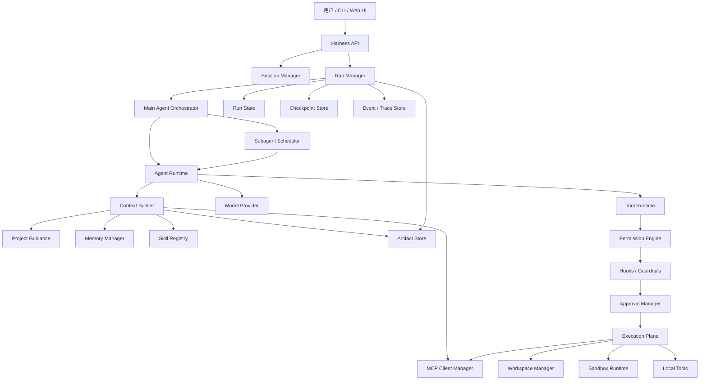
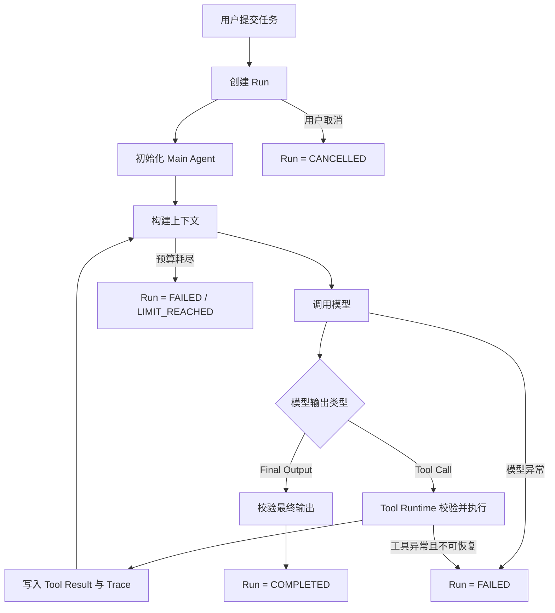
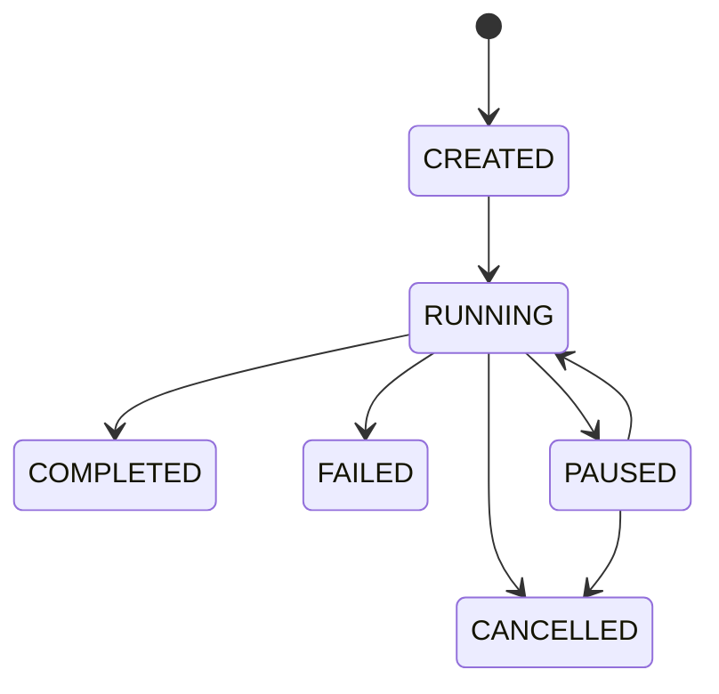

# Harness Agent 项目：阶段 0 总体设计基线

> 文档版本：v0.1  
> 文档日期：2026-07-11  
> 当前阶段：阶段 0——总体设计与实现边界  
> 后续阶段：阶段 1——单 Agent Harness  
> 主要用途：作为后续开发、评审和 Codex 实现时的统一上下文  
> 当前约束：本阶段只完成总体设计，不开始编写 Harness 业务代码

---

## 1. 文档目的

本项目要从零构建一个较完整的 Agent Harness，而不是将现有黑板模式多智能体项目改造为 Harness，也不直接使用 LangGraph、OpenAI Agents SDK、CrewAI、AutoGen 等框架替代核心 Runtime。

阶段 0 的目的不是一次性完成所有详细设计，而是建立一套足以指导后续开发的总体设计基线，明确：

1. 项目要解决什么问题，以及暂时不解决什么问题；
2. 采用哪一种多 Agent 协作模式；
3. 整体系统由哪些模块组成；
4. 模块之间的职责边界是什么；
5. 一次 Agent Run 的主流程如何运转；
6. Tool、Skill、MCP、Memory、Project Guidance 等概念如何区分；
7. 权限、审批、Hook、Guardrail 和 Sandbox 如何分层；
8. 哪些核心机制自行实现，哪些通用基础设施使用成熟库；
9. 各开发阶段分别实现什么；
10. 阶段 1 的范围和验收标准是什么。

阶段 0 完成后，应直接进入阶段 1：单 Agent Harness。  
阶段 0 不负责把所有数据库字段、恢复算法、权限细节和长期记忆算法提前设计完。

---

## 2. 项目定位

### 2.1 项目定义

本项目拟构建：

> 一个通用、可扩展、可观测、可恢复并具备安全执行边界的 Agent Harness。用户始终与主 Agent 交互；主 Agent 可以根据任务动态调用受限子 Agent；系统能够接入本地工具、Skill、MCP、记忆、权限审批和沙箱执行能力。

第一验证场景采用复杂代码仓库任务，例如：

```text
分析一个 FastAPI 项目；
定位用户登录流程；
增加登录限流功能；
补充测试；
检查安全风险；
输出最终修改结果和执行记录。
```

选择 Coding Agent 作为第一验证场景，是因为代码任务能够同时验证：

- 文件与代码检索；
- 上下文构建；
- 工具调用循环；
- 文件修改；
- 命令与测试执行；
- 多 Agent 委派；
- 权限审批；
- 网络与依赖安装控制；
- 沙箱隔离；
- 中断与恢复；
- Trace 和评测。

底层 Harness 不应与“代码修复”这一单一任务强绑定，后续应能够扩展到研究、数据分析、文档处理和企业工作流等执行型 Agent。

### 2.2 项目核心价值

项目价值不在于“使用了多个 Agent”，而在于掌握并实现以下 Harness 核心机制：

```text
Agent Loop
Context Engineering
Tool Runtime
Subagent Scheduling
Permission Enforcement
Approval and Resume
Sandbox Isolation
Memory Lifecycle
Skill Loading
MCP Integration
State and Checkpoint
Trace and Evaluation
```

### 2.3 项目非目标

第一轮完整实现暂不追求：

- A2A Agent 自由通信；
- Handoff 后由子 Agent 接管用户会话；
- 无限层级的子 Agent 递归创建；
- 固定且不可变的工作流图；
- 企业级多租户与组织权限；
- 大规模分布式集群调度；
- 插件市场；
- 桌面客户端；
- Computer Use；
- 完全无人监管的长期自治执行；
- 完整复刻 Codex、Claude Code 或 OpenHands 的全部产品能力。

---

## 3. 参考系统调研结论

阶段 0 的设计基线主要参考以下成熟系统的官方资料。

### 3.1 Codex

Codex 官方将 Agent Loop 视为 Harness 的核心逻辑：它协调用户、模型和工具之间的多轮交互，并负责随着工具调用增加而不断增长的上下文。[R1]

Codex 的 Subagent 模式允许主线程生成多个专业子 Agent，并行完成探索、分析或实现任务，最后由主线程收集和整合结果。[R2]

Codex 将以下能力明确分离：

- `AGENTS.md`：稳定的项目指导和行为要求；
- Memories：从过去工作中保留的辅助上下文；
- Skills：可复用的工作流程和资源包；
- MCP：连接本地工作区之外的系统和数据。[R3]

Codex Skills 使用 `SKILL.md` 加可选的脚本、参考资料和资源，并采用渐进加载方式：初始上下文只包含 Skill 的名称与描述，真正选中后才读取完整说明。[R4]

Codex 的安全设计将 Sandbox 与 Approval 分成两个层次：Sandbox 决定技术上允许访问和修改的范围；Approval 决定哪些操作必须先请求用户确认。[R5]

**本项目借鉴：**

- 自研 Agent Loop；
- 主 Agent 集中管理 Subagent；
- Project Guidance、Memory、Skill、MCP 分离；
- Skill 渐进加载；
- Sandbox 与 Approval 分层。

### 3.2 Claude Code

Claude Code 的 Subagent 是运行在独立上下文窗口中的专业助手，可以拥有独立系统提示词、工具范围和权限。它适合处理会产生大量搜索结果、日志或文件内容的旁路任务，只将摘要返回主上下文。[R6]

Claude Code 的 Hooks 可以挂接到工具调用、子 Agent 启停、任务完成等生命周期事件，用于确定性地执行检查或控制逻辑。[R7]

**本项目借鉴：**

- 子 Agent 独立上下文；
- 每种 Agent 明确限定工具和权限；
- 大量中间日志留在子 Agent Trace 中；
- 生命周期 Hook 独立于模型提示词；
- 子 Agent 返回精炼或结构化结果。

### 3.3 OpenHands

OpenHands 将 Agent、工具、Workspace、事件和安全策略作为独立架构组件；其 Docker Runtime 在隔离容器中执行任意代码，以降低对宿主机的风险。[R8][R9]

OpenHands 的事件系统使用不可变、类型化事件形成追加式日志，用于驱动执行、状态管理和外部服务集成。[R10]

**本项目借鉴：**

- 控制平面与执行平面分离；
- Workspace 与 Sandbox 抽象；
- Agent 不直接调用宿主机任意副作用接口；
- 统一事件模型；
- 追加式运行记录。

### 3.4 OpenAI Agents SDK

OpenAI Agents SDK 的运行循环会持续执行“模型调用—工具调用—再次模型调用”，直到获得最终输出或出现终止条件。[R11]

其 Human-in-the-loop 机制允许工具声明审批要求；Run 产生待审批中断，并可通过可序列化的 `RunState` 在用户决策后恢复。[R12]

其 Trace 覆盖模型生成、工具调用、Guardrail、Handoff 和自定义事件。[R13]

**本项目借鉴：**

- Run 作为一次完整执行的顶层边界；
- Tool Call 审批作为可暂停事件；
- 审批后恢复原执行位置；
- Trace 覆盖 Agent 运行的关键语义事件。

### 3.5 LangChain Subagents

LangChain 的 Subagent 模式采用中心主 Agent（Supervisor）调用子 Agent 工具。主 Agent决定调用哪个子 Agent、传入什么内容，以及如何合并结果；子 Agent 不直接面向用户。[R14]

LangChain 默认将 Subagent 视为无状态调用，以获得干净的上下文隔离；它也区分同步等待和异步后台任务。[R14]

**本项目借鉴：**

- Main Agent + Subagent as Tool；
- 所有路由经过主 Agent；
- 子 Agent 默认不直接保存用户会话历史；
- 第一版采用同步或并发等待，后台任务后续再设计。

### 3.6 MCP

MCP 标准化应用与外部上下文、工具和工作流之间的连接。Server 可暴露：

- Resources：上下文和数据；
- Prompts：模板化消息或流程；
- Tools：可由模型调用的函数。[R15]

MCP Tool 能触发外部数据访问和代码执行，因此 Host 仍须实施可见性、授权和人工拒绝能力，不能因为工具来自 MCP Server 就默认可信。[R16]

**本项目借鉴：**

- MCP 作为外部能力接入协议，而不是 Memory 的同义词；
- MCP 能力统一转换为 Harness 内部定义；
- MCP 调用继续经过内部权限、审批、Trace 和输出清理；
- 不信任 Server 自述的安全等级。

---

## 4. 已确定的总体设计决策

### 4.1 多 Agent 模式

采用：

```text
Main Agent + Subagent as Tool
```

不采用：

```text
Agent-to-Agent 自由通信
Handoff 接管用户会话
固定流水线式多 Agent
```

基本规则：

1. 用户只与 Main Agent 交互；
2. Main Agent 始终持有会话控制权；
3. Subagent 通过内部 Agent Tool 被调用；
4. Subagent 在独立上下文中执行；
5. Subagent 只获得完成任务所需的最小上下文、工具和权限；
6. Subagent 不直接向用户给出最终答案；
7. Subagent 返回结构化结果或 Artifact 引用；
8. Subagent 之间默认不直接通信；
9. 所有跨 Agent 协调由 Main Agent 完成；
10. 第一版只允许一层子 Agent。

### 4.2 核心 Runtime 路线

采用：

> 自研核心 Agent Harness Runtime + 成熟通用基础设施。

必须自行设计和实现：

- Agent Loop；
- Run 生命周期；
- Context Builder；
- Tool Runtime；
- Subagent Scheduler；
- 父子上下文传递；
- Permission Engine；
- Approval 与 Resume 语义；
- Memory 策略；
- Checkpoint 语义；
- Agent 业务事件模型；
- 评测指标与实验方案。

可以使用成熟库：

- 模型官方客户端或 OpenAI-compatible 客户端；
- Pydantic / JSON Schema；
- FastAPI；
- SQLAlchemy / Alembic；
- SQLite / PostgreSQL；
- Docker Engine 与 Docker SDK；
- 官方 MCP SDK；
- OpenTelemetry；
- `asyncio`；
- `pytest`。

核心 Runtime 不直接建立在以下框架的 Runner 之上：

- LangGraph；
- OpenAI Agents SDK Runner；
- CrewAI；
- AutoGen；
- Deep Agents。

这些框架可作为调研对象、对照基线或实验分支，但不能替代项目核心机制。

---

## 5. 总体架构



### 5.1 分层说明

#### Client Layer

负责：

- 用户输入；
- 结果展示；
- 流式事件展示；
- 审批交互；
- 取消任务。

不负责：

- Agent 推理；
- 权限计算；
- 工具执行；
- 状态恢复。

#### Control Plane

负责：

- Session 和 Run 管理；
- Main Agent 调度；
- Subagent 生命周期；
- 审批；
- 暂停、取消和恢复；
- 预算控制。

#### Agent Plane

负责：

- 单个 Agent 的推理循环；
- 上下文构建；
- 模型适配；
- Tool Call 解析；
- 结构化输出校验。

#### Capability Plane

包括：

- Tool；
- Skill；
- MCP；
- Memory；
- Project Guidance。

它们必须保持概念和接口分离。

#### Enforcement Layer

负责：

- 权限校验；
- 执行前后 Hook；
- 输入输出 Guardrail；
- 用户审批；
- Secret、网络和文件策略。

#### Execution Plane

负责：

- Workspace；
- Sandbox；
- 文件操作；
- 命令运行；
- 外部副作用执行；
- Artifact 生成。

#### Persistence and Observability

负责：

- 当前 Run State；
- Checkpoint；
- Session History；
- Memory；
- Event Log；
- Trace；
- Metrics；
- Artifact 元数据。

---

## 6. 核心模块职责边界

阶段 0 只定义模块职责，不在此确定全部类、方法和数据库字段。

### 6.1 Run Manager

负责：

- 创建 Run；
- 维护 Run 顶层状态；
- 管理开始、完成、失败和取消；
- 调用 Agent Runtime；
- 记录顶层事件；
- 后续接入暂停与恢复。

不负责：

- 构造模型 Prompt；
- 直接执行工具；
- 自行判断工具权限。

### 6.2 Agent Runtime

负责单个 Agent 的核心循环：

```text
构建上下文
→ 调用模型
→ 解析模型输出
→ 执行 Tool Call
→ 将结果写回 Agent 上下文
→ 再次调用模型
→ 获得最终输出或终止
```

不负责：

- 直接操作 Docker；
- 绕过 Tool Runtime 执行副作用；
- 直接处理前端 UI；
- 自行持久化所有业务数据。

### 6.3 Main Agent Orchestrator

负责：

- 维护主任务目标；
- 决定是否委派；
- 选择 Subagent；
- 合并 Subagent 结果；
- 对最终输出负责。

不负责：

- 实现所有专业任务；
- 绕过 Scheduler 创建 Agent；
- 绕过 Permission Engine 授权。

### 6.4 Subagent Scheduler

负责：

- 创建 AgentInstance；
- 设置任务、预算、工具和权限；
- 限制并发数量和嵌套深度；
- 等待、取消和关闭；
- 返回结构化结果；
- 记录父子 Trace。

不负责：

- 直接决定用户最终回答；
- 自行增加权限；
- 直接执行 Tool；
- 保存一套独立于 Run State 的事实状态。

### 6.5 Context Builder

负责根据 Token 预算组合：

- 系统规则；
- Agent Definition；
- 用户任务；
- 项目指导；
- 当前任务状态；
- 相关 Memory；
- Skill 摘要或完整内容；
- Tool Schema；
- MCP 能力摘要；
- 最近消息；
- 工具结果；
- Artifact 引用。

不负责：

- 执行工具；
- 决定权限；
- 将所有历史无条件塞入上下文。

### 6.6 Tool Runtime

负责：

- Tool 注册；
- Schema 暴露；
- 参数校验；
- 调用 Permission Engine；
- 调用 Hook / Guardrail；
- 处理审批；
- 超时与异常；
- 输出截断与脱敏；
- 记录执行事件。

不负责：

- 让 Tool 自行绕过统一运行层；
- 将工具自然语言描述当作安全保证。

### 6.7 Skill Registry

负责：

- Skill 发现；
- 元数据索引；
- 渐进加载；
- Skill 版本；
- Skill 附带脚本、参考资料和资源的访问。

不负责：

- 替代 Tool；
- 自动获得超出 Agent 权限范围的能力；
- 将所有 Skill 完整内容默认注入 Prompt。

### 6.8 MCP Client Manager

负责：

- MCP Server 配置；
- 连接生命周期；
- 能力协商；
- Tools、Resources、Prompts 发现；
- MCP 能力到内部定义的转换；
- 认证、超时、重试和 Trace；
- Agent 可见范围。

不负责：

- 默认信任 MCP Server；
- 绕过内部权限和审批；
- 将 MCP 等同于 Memory。

### 6.9 Memory Manager

负责：

- Memory 写入策略；
- 检索；
- Scope；
- 来源追踪；
- 置信度；
- 失效、删除和纠错；
- 后续的冲突处理。

不负责：

- 保存必须强制遵守的项目规则；
- 将当前任务状态全部混入长期记忆；
- 让模型无审核地写入任意长期事实。

### 6.10 Permission Engine

负责计算：

```text
有效权限
=
系统最大能力
∩ 用户或运行级授权
∩ 父 Agent 可委派能力
∩ 当前 Agent 角色上限
∩ Tool 所需权限
∩ Sandbox 实际能力
```

不负责：

- 仅依赖 Prompt 进行安全控制；
- 让子 Agent 获得父 Agent 没有的权限；
- 代替 Sandbox 的系统级限制。

### 6.11 Sandbox Runtime

负责：

- 隔离命令执行；
- 工作目录限制；
- 文件挂载策略；
- 网络控制；
- CPU、内存、进程和时间限制；
- Secret 隔离；
- 环境创建与销毁。

不负责：

- 判断业务上是否应该审批；
- 根据自然语言猜测用户授权。

### 6.12 Event / Trace Store

负责记录：

- Run；
- Agent；
- Model Turn；
- Tool Call；
- Permission Decision；
- Approval；
- Skill；
- Memory；
- MCP；
- Sandbox；
- Error；
- Artifact。

不负责：

- 将 Trace 当作当前业务状态的唯一读取接口；
- 将所有大型文件内容直接放入事件记录。

---

## 7. 一次 Run 的生命周期骨架

阶段 0 只确定正常主流程和顶层结束分支，不提前实现完整 Checkpoint 与恢复算法。

### 7.1 阶段 1 使用的最小流程



### 7.2 顶层状态骨架

阶段 0 先定义：

```text
CREATED
RUNNING
COMPLETED
FAILED
CANCELLED
```

为后续阶段预留：

```text
PAUSED
WAITING_APPROVAL
```

第一版转换关系：



### 7.3 阶段 0 不详细设计的内容

以下内容留到对应开发阶段再确定：

- 每个状态的完整数据库字段；
- Event Sequence 和版本冲突；
- Checkpoint 二进制或 JSON 格式；
- 审批后恢复到模型轮次还是 Tool Call；
- 副作用 Tool 的幂等键；
- 程序崩溃后如何判断 Tool 是否已真实执行；
- 父子 Agent 状态传播；
- 并发 Agent 修改冲突；
- 后台任务和跨进程恢复；
- Event Sourcing 是否作为最终状态重建方式。

---

## 8. 核心概念边界

### 8.1 Tool

Tool 是一个可执行动作，例如：

```text
read_file
search_code
write_file
run_command
call_api
spawn_subagent
```

Tool 应包含：

- 名称与描述；
- 输入 Schema；
- 输出 Schema；
- 所需权限；
- 超时；
- 副作用等级；
- 是否需要审批；
- 幂等性声明；
- 执行器。

### 8.2 Skill

Skill 是一套可复用的任务方法、说明和配套资源，例如：

```text
如何修改 FastAPI API 并完成回归验证
如何排查 Python 包导入错误
如何执行安全代码审查
```

Skill 可以引用 Tool，但 Skill 本身不等同于 Tool。

建议目录：

```text
skills/
└── fastapi-api-change/
    ├── SKILL.md
    ├── scripts/
    ├── references/
    └── assets/
```

### 8.3 MCP

MCP 是外部能力连接协议，可以提供：

```text
Resources
Prompts
Tools
```

MCP 不是记忆系统。  
Memory Service 可以通过 MCP 暴露，但这不改变 Memory 的业务语义。

### 8.4 Project Guidance

Project Guidance 是必须稳定遵守的项目级规则，例如：

- 构建命令；
- 测试命令；
- 目录规范；
- 禁止修改区域；
- 编码规范；
- 架构约束。

这类信息应保存在项目文件或版本控制中，而不是仅依赖自动 Memory。

### 8.5 Memory

Memory 是从过去交互和任务中保留下来的可检索信息。

后续至少区分：

- Session Memory：同一会话；
- Task Memory：当前 Run；
- Project Memory：跨任务项目经验；
- Agent Memory：特定 Agent 类型的经验；
- User Memory：用户长期偏好，若未来需要。

### 8.6 Artifact

Artifact 用于保存不适合直接放入模型消息、事件或数据库字段的大型结果，例如：

- 代码 Diff；
- 测试日志；
- 搜索结果；
- 文件快照；
- 分析报告；
- 编译产物；
- 子 Agent 证据。

上下文中优先传递 Artifact 摘要和引用，而不是重复拷贝全部内容。

---

## 9. 安全设计骨架

安全机制必须分成四个层次。

### 9.1 Permission

回答：

> 当前 Agent 是否拥有请求某种能力的资格？

初始能力集合可包括：

```text
FILE_READ
FILE_WRITE
FILE_DELETE
COMMAND_EXECUTE
PACKAGE_INSTALL
NETWORK_ACCESS
SECRET_ACCESS
MCP_TOOL_CALL
SUBAGENT_CREATE
GIT_COMMIT
GIT_PUSH
EXTERNAL_SIDE_EFFECT
```

### 9.2 Approval

回答：

> 即使 Agent 拥有能力，本次具体调用是否仍需用户确认？

例如：

- 普通读取：无需审批；
- 工作区内代码修改：可以按策略自动允许；
- 文件删除：需要审批；
- 安装依赖：需要审批；
- 网络访问：需要审批或域名白名单；
- Git Push：必须审批。

### 9.3 Hook / Guardrail

Hook 用于生命周期中的确定性检查，例如：

- Tool 执行前；
- Tool 执行后；
- Subagent 创建前；
- Subagent 完成后；
- Run 完成前。

Guardrail 用于语义检查，例如：

- 敏感信息泄漏；
- Prompt Injection；
- 不安全命令；
- 输出格式；
- 任务偏离。

Guardrail 不能代替 Permission 和 Sandbox。

### 9.4 Sandbox

回答：

> 即使前面的模型或策略判断出现错误，操作实际最多能影响到哪里？

默认方向：

- 仅挂载当前 Workspace；
- 默认关闭网络；
- 不注入宿主机 Secret；
- 限制 CPU、内存、进程数和时间；
- 对关键路径只读；
- 控制输出大小；
- 任务结束销毁环境。

---

## 10. 状态、事件和 Artifact 的关系

总体采用：

```text
Run State
+
Append-only Event Log
+
Artifact Store
```

### 10.1 Run State

表示“系统现在处于什么状态”，便于快速读取和后续恢复。

例如：

```text
当前 Run 状态
当前 Agent
当前模型轮次
剩余预算
待审批数量
已创建 Subagent 数量
最终结果引用
```

### 10.2 Event Log

表示“为什么演变成当前状态”，用于：

- Trace；
- 审计；
- 调试；
- 重放；
- 评测；
- 状态恢复辅助。

### 10.3 Artifact Store

保存大型内容，Event 和 State 只保存引用与元数据。

阶段 0 不决定 Event Sourcing 是否是唯一状态重建方式。阶段 1 先实现简单 Run State 和基础事件记录，运行后再判断是否需要加强事件驱动程度。

---

## 11. 开发阶段划分

### 阶段 0：总体设计

完成：

- 项目目标与非目标；
- 参考系统调研；
- 总体架构；
- 模块职责边界；
- Run 生命周期骨架；
- 顶层状态骨架；
- 概念边界；
- 安全分层；
- 技术路线；
- 分阶段规划；
- 阶段 1 范围与验收标准。

不编写核心 Harness 业务代码。

### 阶段 1：单 Agent Harness

实现：

- Model Provider；
- Agent Definition；
- Agent Loop；
- Context Builder；
- Tool Registry；
- Tool Runtime；
- 基础 Run State；
- 基础 Trace；
- CLI；
- 最大轮次、工具次数和 Token/时间预算。

暂不实现：

- Subagent；
- 长期 Memory；
- Skill；
- MCP；
- HITL；
- Checkpoint 持久恢复；
- Docker Sandbox；
- 复杂权限；
- Web UI。

### 阶段 2：Subagent Runtime

实现：

- Agent Registry；
- Subagent as Tool；
- `spawn`、`wait`、`cancel`、`close`；
- 独立上下文；
- 工具与权限限制；
- 结构化输出；
- 并发限制；
- 父子 Trace；
- 一层嵌套限制。

### 阶段 3：Permission、Approval 与 Sandbox

实现：

- Permission Engine；
- Tool 风险等级；
- Approval Request / Decision；
- Hook / Guardrail；
- Docker Sandbox；
- Workspace Policy；
- Network Policy；
- Secret Policy；
- 暂停与基础恢复。

### 阶段 4：Project Guidance 与 Skill

实现：

- 项目指导加载；
- 作用域与覆盖顺序；
- Skill Registry；
- Skill 发现；
- 渐进加载；
- Skill 资源和脚本；
- Skill 使用 Trace；
- Skill 评测。

### 阶段 5：MCP

实现：

- 官方 MCP SDK 接入；
- Server Registry；
- 连接和能力协商；
- Tools / Resources / Prompts；
- Agent 可见范围；
- MCP 权限映射；
- MCP 调用审批；
- MCP Trace。

### 阶段 6：Memory、Checkpoint 与恢复

实现：

- Session / Task / Project / Agent Memory；
- Memory 来源与置信度；
- 写入、检索、失效和删除；
- Checkpoint；
- 进程重启恢复；
- Tool 幂等与副作用恢复；
- 审批后精确恢复。

### 阶段 7：评测与界面

实现：

- 任务数据集；
- 成功率；
- 子 Agent 委派收益；
- Token、成本和延迟；
- 安全阻断与误阻断；
- Memory 污染率；
- Skill 激活准确率；
- Trace 可视化；
- Web UI。

---

## 12. 阶段 1 的明确范围

### 12.1 最小工具

第一版至少实现：

```text
list_files
read_file
search_code
```

可选增加受限版：

```text
run_command
```

如果加入 `run_command`，必须先使用命令白名单、工作目录限制、超时和输出上限；阶段 1 不假装已经具备完整 Sandbox。

### 12.2 Agent Loop 最小语义

```text
1. 接收用户任务；
2. 创建 Run；
3. 构建模型上下文；
4. 调用模型；
5. 如果模型返回 Tool Call：
   5.1 校验 Tool 名称；
   5.2 校验参数；
   5.3 执行 Tool；
   5.4 生成统一 ToolResult；
   5.5 将结果写回上下文；
   5.6 继续模型循环；
6. 如果模型返回 Final Output：
   6.1 校验输出；
   6.2 结束 Run；
7. 如果超过限制或出现不可恢复错误：
   7.1 将 Run 标记为失败；
   7.2 保留 Trace；
   7.3 返回明确错误。
```

### 12.3 阶段 1 验收标准

阶段 1 完成必须满足：

1. 用户能够通过 CLI 提交真实任务；
2. Agent 能够调用至少两个不同工具；
3. 工具结果正确进入下一轮模型上下文；
4. 模型可以基于工具结果继续推理；
5. 模型能够产生最终输出并正常结束 Run；
6. 系统限制最大模型轮次；
7. 系统限制最大工具调用次数；
8. 模型或工具错误不会导致进程无控制崩溃；
9. 每轮模型调用和工具调用都有基础 Trace；
10. Runtime 不与某一家模型 Provider 强绑定；
11. Tool 具有统一 Schema 和统一结果格式；
12. 后续可以将 Subagent 包装为一种 Tool，而不重写 Agent Loop；
13. 阶段 1 不虚假宣称具备长期记忆、完整权限、Sandbox 或持久恢复；
14. 为阶段 2 和阶段 3 预留明确扩展点。

---

## 13. 阶段 0 结束条件

满足以下条件后，停止继续扩大阶段 0，直接开始阶段 1：

- [x] 项目目标与非目标明确；
- [x] 多 Agent 模式确定；
- [x] 核心 Runtime 技术路线确定；
- [x] 总体架构确定；
- [x] 核心模块职责确定；
- [x] Run 正常流程骨架确定；
- [x] 顶层状态骨架确定；
- [x] Tool、Skill、MCP、Memory 和 Project Guidance 边界明确；
- [x] Permission、Approval、Hook/Guardrail、Sandbox 分层明确；
- [x] 阶段划分明确；
- [x] 阶段 1 范围和验收标准明确。

阶段 0 不因以下问题尚未解决而继续无限延长：

- 数据库最终选型；
- 完整数据库表；
- 完整事件类型；
- Checkpoint 序列化格式；
- 长期记忆算法；
- 向量数据库；
- Docker 镜像细节；
- 并发写冲突策略；
- 多层子 Agent；
- Web 前端设计。

这些问题应在对应阶段开始前再进行局部详细设计。

---

## 14. 后续阶段应遵守的工程原则

1. **先复现成熟机制，再创新。**  
   初版优先建立可靠基线；改进必须由真实 Trace、失败案例和评测结果触发。

2. **模型提出动作，系统决定是否执行。**  
   Tool、Subagent、MCP 和副作用操作均不得绕过统一 Runtime。

3. **安全不能只写在 Prompt 中。**  
   Permission、Approval、Hook 和 Sandbox 必须有代码级与系统级实现。

4. **上下文按需构建。**  
   不默认复制全部对话、全部工具日志或整个代码仓库。

5. **子 Agent 必须有明确边界。**  
   任务、输入、工具、权限、预算和输出格式都应受控。

6. **状态应有唯一事实来源。**  
   各组件不能分别维护相互矛盾的隐式状态。

7. **大型内容使用 Artifact。**  
   Trace、消息和状态只保存摘要、元数据和引用。

8. **所有关键行为可观测。**  
   模型调用、工具、权限、审批、Subagent、Memory、Skill、MCP 和 Sandbox 都要进入 Trace。

9. **不要提前构建未经验证的复杂系统。**  
   每个阶段只详细设计和实现当前必须解决的问题。

10. **阶段验收后再进入下一阶段。**  
    不允许在单 Agent Loop 尚未稳定时直接堆叠 Subagent、Memory 和 MCP。

---

## 15. 给 Codex 的执行说明

当后续要求 Codex 开始实现阶段 1 时，应以本文件为总体约束，并遵守：

```text
1. 不接入原有黑板模式项目；
2. 创建独立的新项目；
3. 不使用 LangGraph、OpenAI Agents SDK Runner、CrewAI 或 AutoGen
   替代核心 Agent Loop；
4. 可以使用成熟通用库；
5. 当前只实现阶段 1；
6. 不提前实现 Subagent、Memory、Skill、MCP、HITL 或 Docker Sandbox；
7. 但所有核心接口必须保留后续扩展能力；
8. 在编码前先提交阶段 1 的详细设计和目录方案；
9. 所有实现必须对应阶段 1 验收标准；
10. 未经明确要求，不得扩大项目范围。
```

---

## 16. 官方参考资料

- **[R1] OpenAI — Unrolling the Codex agent loop**  
  https://openai.com/index/unrolling-the-codex-agent-loop/

- **[R2] OpenAI Developers — Codex Subagents**  
  https://developers.openai.com/codex/subagents

- **[R3] OpenAI Developers — Codex Customization**  
  https://developers.openai.com/codex/concepts/customization

- **[R4] OpenAI Developers — Codex Agent Skills**  
  https://developers.openai.com/codex/skills

- **[R5] OpenAI Developers — Codex Agent approvals & security**  
  https://developers.openai.com/codex/agent-approvals-security

- **[R6] Anthropic — Claude Code Subagents**  
  https://docs.anthropic.com/en/docs/claude-code/sub-agents

- **[R7] Anthropic — Claude Code Hooks**  
  https://docs.anthropic.com/en/docs/claude-code/hooks-guide

- **[R8] OpenHands — SDK Architecture Overview**  
  https://docs.openhands.dev/sdk/arch/overview

- **[R9] OpenHands — Runtime Architecture**  
  https://docs.openhands.dev/openhands/usage/architecture/runtime

- **[R10] OpenHands — Event System**  
  https://docs.openhands.dev/sdk/arch/events

- **[R11] OpenAI Agents SDK — Runner**  
  https://openai.github.io/openai-agents-python/ref/run/

- **[R12] OpenAI Agents SDK — Human-in-the-loop**  
  https://openai.github.io/openai-agents-python/human_in_the_loop/

- **[R13] OpenAI Agents SDK — Tracing**  
  https://openai.github.io/openai-agents-python/tracing/

- **[R14] LangChain — Subagents**  
  https://docs.langchain.com/oss/python/langchain/multi-agent/subagents

- **[R15] Model Context Protocol — Specification**  
  https://modelcontextprotocol.io/specification/2025-11-25

- **[R16] Model Context Protocol — Tools**  
  https://modelcontextprotocol.io/specification/2025-11-25/server/tools

---

## 17. 当前结论

阶段 0 至此形成的最终基线为：

```text
项目类型：
通用 Agent Harness，以 Coding Agent 为第一验证场景。

多 Agent：
Main Agent + Subagent as Tool。

核心 Runtime：
自行实现 Agent Loop、Tool Runtime、上下文和后续调度机制。

状态：
Run State + Event Log + Artifact Store。

能力边界：
Project Guidance、Memory、Skill、MCP、Tool 分离。

安全：
Permission + Approval + Hook/Guardrail + Sandbox。

实施策略：
整体架构在阶段 0 确定；
模块内部细节在对应阶段开始时再详细设计；
阶段 0 完成后直接进入阶段 1：单 Agent Harness。
```
