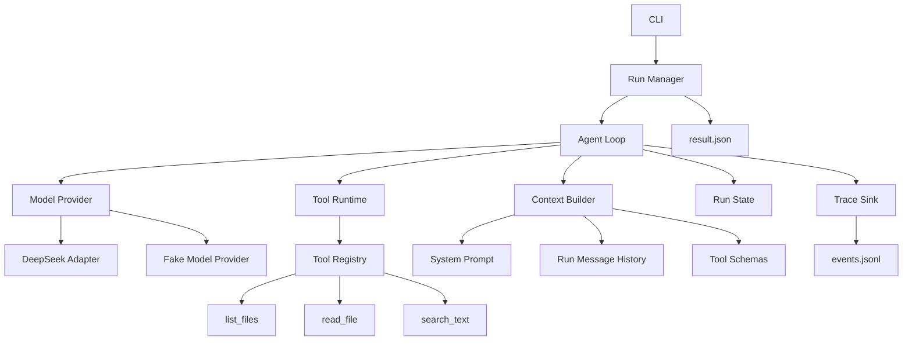

# Harness Agent 项目：阶段 1 单 Agent Harness 详细设计

> 文档版本：v0.1  
> 文档日期：2026-07-11  
> 前置文档：`Harness_Agent_阶段0总体设计.md`  
> 当前阶段：阶段 1——单 Agent Harness  
> 文档性质：实施前详细设计，不包含正式业务代码  
> 主要用途：供 Codex 按照明确边界完成阶段 1 的编码、测试和验收

---

## 1. 阶段 1 的目标

阶段 1 要实现一个最小但真实、完整、可测试的单 Agent Harness。

它必须真正跑通：

```text
用户提交任务
    ↓
创建 Run
    ↓
构建模型上下文
    ↓
调用模型
    ↓
模型提出一个或多个 Tool Call
    ↓
Harness 校验并执行工具
    ↓
Tool Result 写回模型上下文
    ↓
模型基于结果继续推理
    ↓
模型输出最终结果
    ↓
Run 正常完成并保留 Trace
```

阶段 1 的重点不是实现大量工具，也不是提前加入复杂功能，而是把后续所有能力都会依赖的地基做稳定：

```text
Provider-independent model protocol
Agent Loop
Canonical message model
Tool definition and execution protocol
Context construction
Run state and budget
Error semantics
Trace events
Deterministic tests
CLI execution
```

阶段 1 完成后，阶段 2 的 Subagent 应能够被包装成一种内部 Tool 接入现有循环，而不需要重写 Agent Loop。

---

## 2. 阶段 1 的范围

### 2.1 本阶段必须实现

1. 独立的新项目；
2. Python 包结构；
3. 配置系统；
4. Model Provider 抽象；
5. DeepSeek Provider；
6. Fake / Scripted Provider；
7. Agent Definition；
8. Canonical Message Protocol；
9. Agent Loop；
10. Context Builder；
11. Tool Definition；
12. Tool Registry；
13. Tool Runtime；
14. 三个只读代码仓库工具；
15. 基础 Run State；
16. 执行预算；
17. 统一错误模型；
18. 基础 Trace Event；
19. JSONL Trace Sink；
20. CLI；
21. 单元测试；
22. 集成测试；
23. 一个本地 Demo Repository；
24. README 和运行说明；
25. 阶段 1 验收演示。

### 2.2 本阶段明确不实现

```text
Subagent
Agent as Tool
多 Agent 并发
长期 Memory
Project Memory
Skill
MCP
HITL Approval
Checkpoint Resume
数据库持久化
Docker Sandbox
通用 shell 执行
文件写入
代码补丁
网络工具
Web API
Web UI
后台任务
上下文自动摘要
向量检索
完整 Tokenizer 适配
OpenTelemetry Export
```

其中部分接口需要预留，但不能因为“以后要用”而在阶段 1 提前实现复杂逻辑。

---

## 3. 设计依据

### 3.1 Agent Loop

Codex 将 Agent Loop 定义为 Harness 的核心逻辑：负责协调用户、模型和工具。一次用户交互内部可以包含多轮模型推理和工具调用；随着历史和工具结果增加，Harness 还需要承担上下文管理职责。

阶段 1 借鉴这一机制，但只实现：

```text
single root agent
sequential model turns
tool calling
basic context limits
basic trace
```

不实现 Codex 的 Subagent、完整 compaction、审批和 Sandbox。

### 3.2 Tool Calling

标准 Tool Calling 是应用与模型之间的多步协议：

```text
向模型提供 Tool Schema
→ 模型返回 Tool Call
→ 应用执行 Tool
→ 将 Tool Result 连同 Tool Call ID 返回模型
→ 模型继续推理或完成
```

Harness 必须保存模型原始 Tool Call 和对应 ID，不能只把工具结果作为普通用户消息重新发送。

模型可能一次返回多个 Tool Call。阶段 1 必须能够解析多个调用，但先按照模型返回顺序串行执行，以保证实现简单、Trace 确定和错误行为可预测。并行 Tool Call 留到后续阶段。

### 3.3 Provider Independence

DeepSeek API 当前支持 OpenAI-compatible API、Tool Calls 和 JSON Output。Tool Call strict 模式可以提高参数符合 JSON Schema 的概率，但仍然必须在 Harness 本地执行参数解析和 Schema 校验。

因此阶段 1 采用：

```text
内部统一协议
    ↓
Provider Adapter
    ↓
DeepSeek Chat Completions API
```

Provider 的原始响应对象不得泄漏到 Agent Loop、Tool Runtime 或测试中。

### 3.4 Async Runtime

阶段 1 使用 Python `asyncio` 构建异步边界。即使第一版 Tool 顺序执行，模型请求、Tool 执行、超时、取消和后续 Subagent 并发都会依赖异步接口。

---

## 4. 关键架构决策

### ADR-101：阶段 1 只实现单 Root Agent

原因：

- 先验证 Agent Loop 和 Tool Runtime；
- 避免 Subagent 掩盖底层问题；
- 后续 Subagent 可作为内部 Tool 复用同一 Runtime。

### ADR-102：使用内部 Canonical Protocol

Agent Loop 不直接依赖 OpenAI、DeepSeek 或 Anthropic 的消息类。

内部统一定义：

```text
CanonicalMessage
ModelRequest
ModelResponse
ToolCall
ToolResult
Usage
FinishReason
```

Provider Adapter 负责转换。

### ADR-103：DeepSeek 使用 Chat Completions Adapter

阶段 1 默认 Provider 为 DeepSeek。

选择原因：

- 用户当前主要使用 DeepSeek；
- DeepSeek 提供 OpenAI-compatible Chat Completions；
- 支持 Tool Calls；
- 容易验证真实 Agent Loop。

但内部协议不得绑定 Chat Completions。未来可以增加：

```text
OpenAI Responses Provider
Anthropic Messages Provider
Local Model Provider
```

### ADR-104：多个 Tool Call 先串行执行

模型可能在一次响应中返回多个 Tool Call。

阶段 1 处理方式：

```text
按返回顺序逐个执行
每个调用产生独立 ToolResult
全部结果写回上下文
再请求下一轮模型推理
```

阶段 1 不做并行，原因：

- 保证确定性；
- 简化取消和异常；
- 避免只读工具未来扩展为有副作用工具后出现竞态；
- 便于 Trace 和测试。

### ADR-105：Tool Error 默认可反馈给模型

以下错误通常不直接终止 Run：

```text
Tool 不存在
参数格式错误
参数 Schema 校验失败
路径不存在
读取越界
搜索无结果
Tool 内部可预期异常
```

Harness 将其转换为：

```text
ToolResult(status="error", ...)
```

并写回模型，使模型有机会修正调用。

以下错误直接终止 Run：

```text
Provider 配置错误
Run State 损坏
内部协议不变量被破坏
Trace Sink 无法保证核心事件记录且配置要求强一致
用户取消
全局预算耗尽
不可恢复的系统异常
```

### ADR-106：阶段 1 状态以内存为主，Trace 持久化

阶段 1 不实现 Checkpoint Resume。

采用：

```text
In-memory RunState
+
Append-only JSONL Trace
+
Final run summary JSON
```

进程退出后不能恢复 Run，这一点必须在 README 中明确。

### ADR-107：阶段 1 不实现通用 run_command

原因：

- 尚未实现 Permission、Approval 和 Sandbox；
- 通用 shell 会过早引入高风险副作用；
- 单 Agent Loop 可以通过只读工具完整验证。

阶段 1 内置工具：

```text
list_files
read_file
search_text
```

可选增加：

```text
git_diff
```

`git_diff` 只读取现有仓库 Diff，不执行任意命令；若底层调用 Git，必须使用固定参数列表而不是拼接 shell 字符串。

---

## 5. 阶段 1 总体架构



### 5.1 运行层次

```text
CLI
  ↓
RunManager
  ↓
AgentLoop
  ├── ContextBuilder
  ├── ModelProvider
  ├── ToolRuntime
  ├── RunState
  └── TraceSink
```

Tool Runtime 不调用模型。  
Provider 不执行工具。  
Context Builder 不改变 Run 状态。  
CLI 不包含业务循环。

---

## 6. 推荐项目目录

```text
agent-harness/
├── pyproject.toml
├── README.md
├── .env.example
├── harness.example.toml
├── docs/
│   ├── phase-0-overview.md
│   └── phase-1-single-agent-design.md
├── src/
│   └── agent_harness/
│       ├── __init__.py
│       ├── cli.py
│       ├── config.py
│       │
│       ├── domain/
│       │   ├── __init__.py
│       │   ├── agent.py
│       │   ├── messages.py
│       │   ├── model.py
│       │   ├── run.py
│       │   ├── tools.py
│       │   ├── events.py
│       │   └── errors.py
│       │
│       ├── runtime/
│       │   ├── __init__.py
│       │   ├── agent_loop.py
│       │   ├── run_manager.py
│       │   ├── budgets.py
│       │   └── cancellation.py
│       │
│       ├── context/
│       │   ├── __init__.py
│       │   ├── builder.py
│       │   ├── prompt.py
│       │   └── limits.py
│       │
│       ├── providers/
│       │   ├── __init__.py
│       │   ├── base.py
│       │   ├── deepseek.py
│       │   └── fake.py
│       │
│       ├── tools/
│       │   ├── __init__.py
│       │   ├── base.py
│       │   ├── registry.py
│       │   ├── runtime.py
│       │   └── builtins/
│       │       ├── __init__.py
│       │       ├── list_files.py
│       │       ├── read_file.py
│       │       └── search_text.py
│       │
│       ├── tracing/
│       │   ├── __init__.py
│       │   ├── sink.py
│       │   ├── jsonl.py
│       │   └── summary.py
│       │
│       └── utils/
│           ├── __init__.py
│           ├── ids.py
│           ├── paths.py
│           ├── time.py
│           └── serialization.py
│
├── tests/
│   ├── unit/
│   │   ├── test_agent_loop.py
│   │   ├── test_context_builder.py
│   │   ├── test_tool_registry.py
│   │   ├── test_tool_runtime.py
│   │   ├── test_path_policy.py
│   │   ├── test_deepseek_adapter.py
│   │   └── test_trace_sink.py
│   ├── integration/
│   │   ├── test_demo_repository_task.py
│   │   └── test_cli.py
│   ├── live/
│   │   └── test_deepseek_live.py
│   ├── fixtures/
│   │   └── demo_repo/
│   └── conftest.py
│
└── .harness/
    └── runs/
        └── <run_id>/
            ├── events.jsonl
            └── result.json
```

说明：

- `domain/` 只放业务协议和状态模型；
- `runtime/` 负责执行语义；
- `providers/` 只处理模型厂商差异；
- `tools/` 负责工具定义和执行；
- `tracing/` 不反向依赖 Runtime；
- `.harness/runs/` 是运行产物，不提交 Git；
- 阶段 1 不创建数据库目录；
- 不创建 `subagents/`、`memory/`、`skills/`、`mcp/`、`sandbox/` 等空壳目录。

---

## 7. 核心领域模型

以下是协议设计，不要求字段名一字不差，但实现不得改变语义。

### 7.1 AgentDefinition

```text
AgentDefinition
├── name
├── description
├── system_prompt
├── model_config
├── enabled_tools
└── limits
```

阶段 1 只有一个 AgentDefinition：

```text
coding_assistant
```

建议字段：

```yaml
name: coding_assistant
description: >
  A repository analysis assistant that inspects files through tools
  and answers based on collected evidence.

model:
  provider: deepseek
  model: configurable
  temperature: 0.0

tools:
  - list_files
  - read_file
  - search_text

limits:
  max_iterations: 20
  max_model_calls: 20
  max_tool_calls: 50
  max_wall_time_seconds: 900
```

### 7.2 CanonicalMessage

内部消息不能直接使用 Provider SDK 对象。

消息角色：

```text
system
user
assistant
tool
```

建议结构：

```text
CanonicalMessage
├── message_id
├── role
├── content
├── tool_calls[]
├── tool_call_id
├── tool_name
├── created_at
└── metadata
```

约束：

- `assistant` 可以同时包含文本和 Tool Call；
- `tool` 必须带 `tool_call_id`；
- Tool Result 必须与历史中已存在的 Tool Call 对应；
- Provider Adapter 负责转换为厂商要求的消息格式；
- Agent Loop 只处理 CanonicalMessage。

### 7.3 ToolDefinition

```text
ToolDefinition
├── name
├── description
├── input_model
├── output_model
├── timeout_seconds
├── risk_level
├── required_capabilities
└── executor
```

阶段 1 虽不实现 Permission Engine，但以下字段必须保留：

```text
risk_level
required_capabilities
```

初始值均为只读能力。

### 7.4 ToolCall

```text
ToolCall
├── id
├── name
├── arguments
├── raw_arguments
├── provider_metadata
└── sequence_index
```

要求：

- `id` 优先使用 Provider 返回的 Tool Call ID；
- Provider 未提供时，由 Harness 生成；
- `arguments` 是 JSON 解析后的对象；
- `raw_arguments` 用于调试；
- 多个调用保持原始顺序。

### 7.5 ToolResult

```text
ToolResult
├── tool_call_id
├── tool_name
├── status
├── content
├── error_code
├── error_message
├── metadata
├── started_at
├── completed_at
└── duration_ms
```

状态：

```text
success
error
cancelled
timeout
```

`content` 是提供给模型的紧凑文本。  
`metadata` 用于 Trace，不应默认全部发送给模型。

### 7.6 ModelRequest

```text
ModelRequest
├── model
├── messages
├── tools
├── tool_choice
├── temperature
├── max_output_tokens
├── timeout_seconds
└── request_metadata
```

### 7.7 ModelResponse

```text
ModelResponse
├── assistant_message
├── tool_calls[]
├── finish_reason
├── usage
├── response_id
├── model
└── provider_metadata
```

`finish_reason` 规范化为：

```text
stop
tool_calls
length
content_filter
error
unknown
```

### 7.8 Usage

```text
Usage
├── input_tokens
├── output_tokens
├── total_tokens
├── cached_input_tokens
└── provider_details
```

Provider 缺少某些字段时使用 `None`，不能伪造为零。

### 7.9 RunState

```text
RunState
├── run_id
├── status
├── task
├── workspace_root
├── agent
├── messages
├── iteration
├── model_call_count
├── tool_call_count
├── usage_total
├── started_at
├── updated_at
├── completed_at
├── final_output
├── error
└── cancellation_requested
```

状态：

```text
CREATED
RUNNING
COMPLETED
FAILED
CANCELLED
```

阶段 1 不启用：

```text
PAUSED
WAITING_APPROVAL
```

### 7.10 RunError

```text
RunError
├── code
├── message
├── category
├── recoverable
├── details
└── cause_type
```

不得只保存 Python Traceback 作为用户可见错误。

---

## 8. Model Provider 设计

### 8.1 Provider 接口

概念接口：

```text
ModelProvider
├── name
├── capabilities
├── complete(request) -> ModelResponse
└── close()
```

必须是异步接口。

Provider Capabilities 至少描述：

```text
supports_tools
supports_parallel_tool_calls
supports_strict_tool_schema
supports_json_output
supports_streaming
supports_usage
max_context_tokens
```

阶段 1 即使不使用所有能力，也要通过 Capabilities 显式描述，不能在 Agent Loop 内通过 Provider 名称写条件判断。

### 8.2 DeepSeek Adapter

职责：

1. 将 Canonical Message 转换为 DeepSeek/OpenAI-compatible Chat Completion message；
2. 将 ToolDefinition 转换为 Function Tool Schema；
3. 发起 API 请求；
4. 解析 Tool Calls；
5. 保留 Tool Call ID；
6. 标准化 finish reason；
7. 标准化 token usage；
8. 将 SDK 异常转换为内部 ProviderError；
9. 执行有限重试；
10. 不执行任何 Tool。

### 8.3 strict Tool Calling

如果当前模型和接口支持 strict：

```text
strict = true
```

但必须继续执行本地校验：

```text
JSON parse
→ Pydantic validation
→ Tool registry lookup
→ local policy validation
```

不能把 Provider strict 视作安全边界。

### 8.4 Provider Retry

阶段 1 对以下错误允许重试：

```text
临时网络错误
连接重置
429 Rate Limit
部分 5xx
Provider Timeout
```

建议默认：

```yaml
max_attempts: 3
initial_backoff_seconds: 1
max_backoff_seconds: 8
jitter: true
```

不重试：

```text
无效 API Key
无效模型名
请求 Schema 错误
上下文超限
本地协议转换错误
用户取消
```

每次重试必须产生 Trace Event。

### 8.5 Fake Provider

必须实现 Scripted / Fake Model Provider，用于测试。

它可以预先配置：

```text
第 1 次调用返回 search_text Tool Call
第 2 次调用返回 read_file Tool Call
第 3 次调用返回最终答案
```

单元测试不得依赖真实 DeepSeek API。

---

## 9. Tool 系统设计

### 9.1 Tool 注册

Tool Registry 负责：

```text
register
get
list
export_schemas
validate_unique_names
```

规则：

- Tool Name 全局唯一；
- 注册时校验描述和输入模型；
- 不允许运行时静默覆盖；
- Tool Schema 顺序稳定，保证测试可复现；
- Agent 只能看到 `AgentDefinition.enabled_tools` 中的 Tool。

### 9.2 Tool 参数校验

执行流程：

```text
接收 ToolCall
    ↓
根据名称查 Registry
    ↓
解析 arguments JSON
    ↓
使用 Pydantic Input Model 校验
    ↓
执行 Workspace / Path Policy
    ↓
运行 Tool
    ↓
使用统一 ToolResult 返回
```

Provider 返回的参数即使是合法 JSON，也必须通过 Pydantic 校验。

### 9.3 Tool Runtime

Tool Runtime 负责：

- Tool 查找；
- 参数校验；
- 执行超时；
- 取消传播；
- 异常映射；
- 输出限制；
- Trace；
- ToolResult 生成。

Tool 函数本身不直接写 Trace。

### 9.4 list_files

用途：

```text
列出 Workspace 内文件和目录
```

建议输入：

```text
path: 相对 Workspace 的路径，默认 "."
recursive: 是否递归
max_depth: 最大深度
include_hidden: 是否包含隐藏文件
limit: 最大条目数
```

安全要求：

- 路径必须限制在 Workspace 内；
- 拒绝 `..` 逃逸；
- 解析符号链接后的真实路径仍必须位于 Workspace；
- 默认忽略 `.git`、`.venv`、`node_modules`、缓存目录；
- 输出排序稳定；
- 超出 limit 时返回 `truncated=true`。

### 9.5 read_file

用途：

```text
读取 Workspace 内文本文件的指定范围
```

建议输入：

```text
path
start_line
end_line
max_chars
```

要求：

- 限制 Workspace；
- 拒绝目录；
- 检测文件大小；
- 默认最多读取有限字符；
- 返回行号；
- 二进制文件返回明确错误；
- 编码优先 UTF-8，失败时返回可解释错误；
- 不自动读取敏感配置文件；
- 阶段 1 可建立基础 denylist，例如 `.env`、私钥文件。

输出示例：

```text
path: src/app.py
lines: 10-42
truncated: false

10 | def main():
11 |     ...
```

### 9.6 search_text

用途：

```text
在 Workspace 中搜索文本或正则表达式
```

建议输入：

```text
query
path
glob
regex
case_sensitive
max_results
context_lines
```

实现策略：

```text
优先使用受控 subprocess 调用 rg
不可用时使用 Python fallback
```

若调用 `rg`：

- 必须使用参数数组；
- 禁止 `shell=True`；
- 固定工作目录；
- 限制执行时间；
- 不允许用户插入任意额外命令参数。

输出必须稳定，包含：

```text
path
line_number
line_text
optional context
truncated
```

### 9.7 Tool Output 限制

初始建议：

```yaml
max_tool_result_chars: 20000
max_file_read_chars: 16000
max_search_results: 100
max_list_entries: 500
tool_timeout_seconds: 30
```

ToolResult 超限时：

- 明确标记 `truncated=true`；
- 告诉模型如何缩小请求；
- 不能静默截断而不说明。

---

## 10. Workspace 与基础路径安全

阶段 1 没有完整 Sandbox，但必须有最小 Workspace Boundary。

### 10.1 Workspace Root

每个 Run 创建时必须指定：

```text
workspace_root
```

要求：

- 转换为绝对真实路径；
- 必须存在；
- 必须是目录；
- 所有文件 Tool 只接受相对路径；
- 所有路径最终解析后必须位于 root 内。

### 10.2 路径逃逸防护

必须测试：

```text
../secret.txt
../../
symlink -> workspace 外部
绝对路径
Windows drive path
UNC path
混合分隔符
```

### 10.3 敏感文件基础规则

阶段 1 只做最小保护：

默认拒绝读取：

```text
.env
.env.*
*.pem
*.key
id_rsa
id_ed25519
credentials.*
```

这不是完整 Secret Policy，只是防止只读工具直接泄露常见 Secret。

README 必须声明：

> 阶段 1 尚不具备完整 Sandbox 和 Secret Detection，不应在不可信仓库或真实敏感环境中运行。

---

## 11. Context Builder 设计

### 11.1 阶段 1 的上下文来源

```text
System Prompt
User Task
Canonical Message History
Tool Definitions
Runtime Metadata
```

阶段 1 不加载：

```text
AGENTS.md
Memory
Skill
MCP Resource
长期项目摘要
向量检索结果
```

### 11.2 System Prompt 目标

System Prompt 只定义稳定行为：

```text
你是代码仓库分析 Agent；
必须通过工具获取证据；
不能假装读取了未读取的文件；
工具错误后应修正参数；
回答应引用实际文件路径和行号；
任务完成后停止调用工具；
没有写工具，不得声称已修改文件；
不得请求或泄露敏感文件；
只使用提供的工具。
```

不要将动态工具结果、任务状态或长篇框架说明写死在 System Prompt 中。

### 11.3 消息历史顺序

严格保持：

```text
system
user
assistant(tool_calls)
tool(result for call 1)
tool(result for call 2)
assistant(...)
...
```

不能：

- 丢失 assistant Tool Call 消息；
- 将 Tool Result 写成 user message；
- 改写 Tool Call ID；
- 在 Provider Adapter 外生成厂商专用消息。

### 11.4 Context Limit

阶段 1 不实现自动摘要。

实现以下保护：

1. Tool 输出在进入历史前已经限制；
2. Context Builder 估算字符数或 Token；
3. 若超过 Provider Context Budget：
   - 优先拒绝继续；
   - 返回 `CONTEXT_LIMIT_EXCEEDED`；
   - 保留完整 Trace；
4. 不允许静默删除关键 Tool Call / Tool Result 配对。

可以实现简单的近似 Token Estimator：

```text
estimated_tokens = chars / configurable_ratio
```

但必须命名为估算，不能冒充精确 Token。

### 11.5 后续扩展点

Context Builder 接口未来应能接收 Context Source：

```text
ProjectGuidanceSource
MemorySource
SkillSource
ArtifactSource
SubagentResultSource
```

阶段 1 不需要实现这些 Source。

---

## 12. Agent Loop 详细流程

### 12.1 伪流程

```text
create RunState(CREATED)
emit run.created

validate workspace and configuration
transition RUNNING
emit run.started

while RUNNING:
    check cancellation
    check wall-time and iteration budgets

    increment iteration
    request = ContextBuilder.build(run_state, tools)

    emit model.requested
    response = Provider.complete(request)
    emit model.completed

    append assistant message

    if response contains tool calls:
        for tool_call in response.tool_calls in original order:
            check tool-call budget
            emit tool.requested
            result = ToolRuntime.execute(tool_call)
            append tool result message
            emit tool.completed
        continue

    if response contains non-empty final text:
        set final_output
        transition COMPLETED
        emit run.completed
        break

    otherwise:
        raise MODEL_PROTOCOL_ERROR
```

### 12.2 Assistant 同时返回文本和 Tool Call

模型可能在同一响应中包含：

```text
assistant content
+
tool_calls
```

处理方式：

- 保留 content；
- 仍然执行 Tool Calls；
- 不将该 content 当作最终答案；
- 下一轮继续推理；
- 只有不包含 Tool Call 的有效 assistant text 才能结束 Run。

### 12.3 多个 Tool Call

阶段 1：

```text
call 1 → result 1
call 2 → result 2
call 3 → result 3
全部写回后再调用模型
```

如果 call 2 失败：

- call 1 结果保留；
- call 2 产生 error ToolResult；
- call 3 仍继续执行，除非 Run 被取消或出现系统级错误；
- 下一轮模型获得全部结果。

### 12.4 空响应

以下情况视作 Provider Protocol Error：

```text
无 Tool Call
无最终文本
无可识别输出
```

不能无限重试模型空响应。

### 12.5 Run 完成判断

阶段 1 完成条件：

```text
模型返回不包含 Tool Call 的非空最终文本
```

不尝试用额外 Judge Agent 判断任务是否真正完成。任务质量由测试和后续 Eval 处理。

### 12.6 Run 取消

CLI 收到 Ctrl+C 或取消信号时：

```text
设置 cancellation_requested
取消当前 Provider 或 Tool Task
Run → CANCELLED
写入 run.cancelled
保存 result.json
```

不能将取消记录成 FAILED。

---

## 13. Budget 与限制

建议默认值：

```yaml
run:
  max_iterations: 20
  max_model_calls: 20
  max_tool_calls: 50
  max_wall_time_seconds: 900

model:
  timeout_seconds: 120
  max_output_tokens: 4096

tools:
  default_timeout_seconds: 30
  max_result_chars: 20000

context:
  max_estimated_input_tokens: configurable
  char_to_token_ratio: 4.0
```

检查顺序：

```text
Run 开始前检查配置
每轮前检查 wall time 和 iteration
模型调用前检查 model calls 和 context
每个 Tool Call 前检查 tool calls
```

预算耗尽时：

```text
Run.status = FAILED
RunError.code = LIMIT_REACHED
```

Trace 中必须指明具体限制：

```text
MAX_ITERATIONS
MAX_MODEL_CALLS
MAX_TOOL_CALLS
MAX_WALL_TIME
CONTEXT_LIMIT
```

---

## 14. 错误语义

### 14.1 错误分类

```text
ConfigurationError
ProviderError
ProviderTimeoutError
ProviderRateLimitError
ProviderAuthenticationError
ProviderProtocolError
ContextLimitError
ToolNotFoundError
ToolInputValidationError
ToolExecutionError
ToolTimeoutError
WorkspaceBoundaryError
BudgetExceededError
CancellationError
InternalInvariantError
```

### 14.2 可恢复 Tool 错误

向模型返回：

```text
status: error
error_code: TOOL_INPUT_VALIDATION
message: ...
suggestion: ...
```

模型可修正后再次调用。

### 14.3 Provider 错误

- 可重试错误：按 Retry Policy 处理；
- 重试耗尽：Run FAILED；
- 身份认证或请求错误：立即 FAILED；
- 所有重试都必须记录。

### 14.4 内部不变量

必须通过断言或显式检查保护：

- ToolResult 必须对应 ToolCall；
- Run COMPLETED 必须存在 final_output；
- Run FAILED 必须存在 RunError；
- `tool_call_count` 与执行记录一致；
- 已完成 Run 不再接收消息；
- Provider 对象不得出现在可序列化 Run Summary 中。

---

## 15. Trace 设计

### 15.1 事件基础字段

```text
event_id
event_type
timestamp
run_id
sequence_number
iteration
parent_event_id
payload
```

### 15.2 阶段 1 事件类型

```text
run.created
run.started
run.completed
run.failed
run.cancelled

iteration.started
iteration.completed

context.built

model.requested
model.retrying
model.completed
model.failed

tool.requested
tool.started
tool.completed
tool.failed
tool.timed_out

budget.exceeded
```

### 15.3 事件中不得默认记录

```text
API Key
完整环境变量
敏感文件内容
Provider Authorization Header
未脱敏异常请求体
```

### 15.4 JSONL Trace

路径：

```text
.harness/runs/<run_id>/events.jsonl
```

要求：

- 每行一个合法 JSON；
- sequence number 单调递增；
- 每次 append 后 flush；
- 编码 UTF-8；
- Trace 写入失败策略可配置；
- 默认核心 Trace 写入失败应终止 Run，避免产生不可审计执行。

### 15.5 result.json

Run 结束后写入：

```text
run_id
status
task
workspace_root
started_at
completed_at
duration_ms
iteration_count
model_call_count
tool_call_count
usage
final_output
error
trace_path
```

不保存 API Key 和 Provider 原始对象。

### 15.6 OpenTelemetry

阶段 1 暂不接入 OpenTelemetry Exporter。

但事件结构要保留未来映射关系：

```text
Run → root span
Model Call → child span
Tool Execution → child span
```

---

## 16. CLI 设计

### 16.1 命令

最低需要：

```text
agent-harness run
agent-harness tools
agent-harness inspect
```

### 16.2 run

示例：

```bash
agent-harness run \
  --workspace ./demo_repo \
  --task "找到价格计算逻辑并解释潜在错误"
```

可选参数：

```text
--provider
--model
--config
--max-iterations
--trace-dir
--no-color
```

任务也可以通过交互输入，但阶段 1 不实现完整聊天会话。

### 16.3 tools

输出已注册工具及简短 Schema：

```bash
agent-harness tools
```

### 16.4 inspect

```bash
agent-harness inspect <run_id>
```

读取 `result.json` 和事件摘要，不恢复 Run。

### 16.5 CLI 输出

运行时至少展示：

```text
Run ID
当前 iteration
模型调用开始/完成
Tool 名称
Tool 状态
最终状态
Trace 路径
最终输出
```

默认不打印模型隐藏推理，也不要求 Provider 返回 Chain of Thought。

---

## 17. 配置设计

### 17.1 配置优先级

```text
CLI 参数
>
环境变量
>
harness.toml
>
默认值
```

### 17.2 示例配置

```toml
[provider]
name = "deepseek"
model = "deepseek-chat"
base_url = "https://api.deepseek.com"
timeout_seconds = 120
max_attempts = 3

[agent]
temperature = 0.0
max_output_tokens = 4096

[run]
max_iterations = 20
max_model_calls = 20
max_tool_calls = 50
max_wall_time_seconds = 900

[tools]
default_timeout_seconds = 30
max_result_chars = 20000

[context]
char_to_token_ratio = 4.0

[trace]
directory = ".harness/runs"
fail_on_write_error = true
```

API Key 只能通过环境变量或 Secret Provider 获取：

```text
DEEPSEEK_API_KEY
```

不得写入示例配置或 Trace。

---

## 18. Prompt 设计

阶段 1 建议只维护一个清晰的 System Prompt 模板。

核心要求：

```text
1. 你只能使用系统提供的工具获取仓库信息。
2. 不要声称看过未通过工具读取的文件。
3. 工具参数错误时，分析错误并使用修正参数重试。
4. 搜索结果不足时，应缩小或调整查询。
5. 回答时引用实际文件路径和行号。
6. 当前没有写文件和命令执行能力，不得声称修改或运行了代码。
7. 不读取、输出或请求常见 Secret 文件。
8. 一旦已有足够证据回答任务，应停止调用工具并给出最终结果。
9. 最终回答需区分已确认事实与推断。
```

Prompt 不应要求模型输出私有 Chain of Thought。  
Trace 只记录可见模型输出、Tool Call 和 Tool Result。

---

## 19. 测试策略

### 19.1 原则

Agent Loop 测试必须确定、快速、不依赖网络。

测试分为：

```text
unit
integration
live
```

### 19.2 Unit Tests

#### Agent Loop

必须覆盖：

1. 模型直接返回最终答案；
2. 一次 Tool Call 后完成；
3. 多轮 Tool Call 后完成；
4. 单轮多个 Tool Call；
5. assistant 同时返回文本与 Tool Call；
6. 未知 Tool；
7. Tool 参数不是合法 JSON；
8. Tool 参数不符合 Schema；
9. Tool 返回 error 后模型修正；
10. Tool 抛出异常；
11. Tool 超时；
12. Provider 临时错误后重试成功；
13. Provider 重试耗尽；
14. Provider 空响应；
15. max iterations；
16. max model calls；
17. max tool calls；
18. Run 取消；
19. 最终 Run State 不变量；
20. Trace 事件顺序。

#### Context Builder

覆盖：

- 消息顺序；
- Tool Call / Result 配对；
- Tool Schema 过滤；
- Context Limit；
- 不静默删除关键消息。

#### Path Policy

覆盖：

- 正常相对路径；
- `../`；
- 绝对路径；
- 符号链接逃逸；
- Windows 路径；
- denylist；
- 不存在路径。

#### Tool Runtime

覆盖：

- Tool 注册重复；
- 参数校验；
- 输出截断；
- timeout；
- error mapping；
- metadata 不进入模型内容。

#### Provider Adapter

使用 Mock SDK Response 验证：

- 普通文本；
- 单 Tool Call；
- 多 Tool Call；
- Tool Call ID；
- JSON arguments；
- finish reason；
- usage；
- Provider 错误映射。

### 19.3 Integration Tests

使用 `tests/fixtures/demo_repo`。

Demo Repo 至少包含：

```text
calculator/
├── __init__.py
├── pricing.py
├── discounts.py
└── tests/
    └── test_pricing.py
```

测试任务示例：

```text
“找出订单总价的计算入口，说明折扣在什么位置应用，
并指出可能导致重复折扣的调用路径。”
```

预期 Agent：

1. list_files；
2. search_text；
3. read_file；
4. 输出带文件路径和行号的回答。

集成测试使用 Fake Provider，不调用真实模型。

### 19.4 Live Test

真实 DeepSeek 测试：

- 使用 `pytest -m live`；
- 默认跳过；
- 需要 `DEEPSEEK_API_KEY`；
- 只验证基本协议兼容；
- 不作为普通 CI 的稳定性门槛；
- 设置成本和调用次数上限。

### 19.5 测试覆盖要求

建议：

```text
核心 runtime、tool runtime、path policy：≥ 90%
整体项目：≥ 80%
```

覆盖率不是唯一标准，但核心状态和错误分支必须有测试。

---

## 20. 阶段 1 演示任务

### 20.1 演示一：仓库结构理解

```text
请分析这个仓库的主要模块，并说明程序入口在哪里。
```

预期：

```text
list_files
search_text
read_file
final answer
```

### 20.2 演示二：调用链定位

```text
请找出 calculate_total 的定义和所有调用位置，
说明折扣计算流程。
```

预期：

- 至少两种工具；
- 至少两轮模型推理；
- 引用真实路径和行号；
- Trace 能还原全过程。

### 20.3 演示三：错误恢复

Fake Provider 第一次生成非法路径：

```text
../../secret.txt
```

Tool 返回 Workspace Boundary Error。

模型下一轮修正为：

```text
src/pricing.py
```

Run 最终完成。

此演示用于证明：

```text
Tool Error 可被模型观察和修正
```

而不是一出现工具错误就整体崩溃。

---

## 21. 阶段 1 验收标准

### 21.1 功能验收

- [ ] 可通过 CLI 提交任务；
- [ ] 可指定 Workspace；
- [ ] 能创建唯一 Run ID；
- [ ] 能调用 DeepSeek；
- [ ] 能使用 Fake Provider；
- [ ] 能向模型暴露 Tool Schema；
- [ ] 能解析单个 Tool Call；
- [ ] 能解析多个 Tool Call；
- [ ] 能执行至少三个只读工具；
- [ ] 能将 Tool Result 正确写回模型；
- [ ] 能进行多轮循环；
- [ ] 能获得最终答案；
- [ ] 能正确结束 Run；
- [ ] 能处理 Tool Error；
- [ ] 能处理 Provider Error；
- [ ] 能处理取消；
- [ ] 能限制模型和工具调用次数；
- [ ] 能输出 JSONL Trace；
- [ ] 能输出 result.json。

### 21.2 架构验收

- [ ] Agent Loop 不依赖 DeepSeek SDK 对象；
- [ ] Provider Adapter 不执行 Tool；
- [ ] Tool 不直接修改 Run State；
- [ ] Context Builder 不执行副作用；
- [ ] CLI 不包含 Agent Loop；
- [ ] Tool Schema 来自统一定义；
- [ ] Tool Call ID 全程保持关联；
- [ ] Provider 可替换；
- [ ] 后续 Subagent 可作为 Tool 接入；
- [ ] 未使用 LangGraph、Agents SDK Runner、CrewAI 或 AutoGen。

### 21.3 安全验收

- [ ] Tool 只能访问 Workspace；
- [ ] 阻止 `..` 路径逃逸；
- [ ] 阻止符号链接逃逸；
- [ ] 默认阻止常见 Secret 文件；
- [ ] 没有通用 shell；
- [ ] 没有文件写入；
- [ ] Tool 参数均执行本地 Schema 校验；
- [ ] Trace 不记录 API Key；
- [ ] README 明确阶段 1 的安全限制。

### 21.4 测试验收

- [ ] 所有 Unit Tests 通过；
- [ ] Integration Tests 通过；
- [ ] Live Test 默认跳过；
- [ ] Fake Provider 能覆盖完整 Agent Loop；
- [ ] 关键错误分支有测试；
- [ ] CI 或本地命令可一键运行测试；
- [ ] Demo Run 有可审计 Trace。

---

## 22. 实施顺序

Codex 应按以下顺序实现，避免边写 Provider 边调 Agent Loop。

### Step 1：项目骨架

完成：

```text
pyproject
package structure
configuration
domain models
error hierarchy
ID and time utilities
```

### Step 2：Fake Provider 与 Canonical Protocol

先实现：

```text
ModelProvider interface
Canonical messages
ModelRequest / ModelResponse
Fake Provider
```

此时不接 DeepSeek。

### Step 3：Tool Definition、Registry 和 Runtime

实现：

```text
ToolDefinition
ToolCall
ToolResult
ToolRegistry
ToolRuntime
Fake Tool
```

先用 Unit Tests 验证。

### Step 4：Agent Loop

使用 Fake Provider + Fake Tool 跑通：

```text
model
→ tool
→ model
→ final
```

先完成所有状态和预算测试。

### Step 5：Context Builder

实现：

```text
system prompt
history
tool schema
context limit
```

### Step 6：只读 Workspace Tools

实现：

```text
list_files
read_file
search_text
path policy
output limits
```

### Step 7：Trace 和 Result Summary

实现：

```text
event model
JSONL sink
result.json
sequence number
redaction
```

### Step 8：DeepSeek Adapter

在 Agent Loop 稳定后接入真实 Provider。

### Step 9：CLI

接入：

```text
run
tools
inspect
Ctrl+C cancellation
```

### Step 10：Demo、文档和验收

完成：

```text
demo_repo
integration test
live test
README
sample trace
acceptance checklist
```

---

## 23. Codex 实施约束

Codex 开始实现时必须遵守：

```text
1. 新建独立项目，不修改黑板模式项目。
2. 当前只实现阶段 1。
3. 不创建空壳式 Subagent、Memory、Skill、MCP、Sandbox 模块。
4. 不使用 Agent 框架 Runner 替代自研循环。
5. 先使用 Fake Provider 完成 Agent Loop 测试，再接 DeepSeek。
6. Provider SDK 对象不得泄漏到 domain 和 runtime。
7. Tool 只能通过 ToolRuntime 执行。
8. 所有文件路径必须经过 Workspace Boundary 校验。
9. 不实现通用 run_command。
10. 不实现写文件能力。
11. 不实现自动上下文摘要。
12. 不实现数据库和 Checkpoint。
13. 不将 Provider strict mode 视作本地校验替代品。
14. 每一个关键状态分支必须有测试。
15. 未经明确批准，不扩大阶段 1 范围。
```

Codex 在正式编码前，应先提交：

```text
1. 最终目录树；
2. 核心类型列表；
3. Agent Loop 流程；
4. Tool Runtime 流程；
5. 测试列表；
6. 与本文档存在差异的地方及理由。
```

---

## 24. 阶段 1 完成后才能进入阶段 2 的条件

只有满足以下条件，才开始设计和实现 Subagent Runtime：

```text
单 Agent Loop 已稳定运行；
Tool Call ID 和消息顺序正确；
Fake Provider 测试完备；
真实 DeepSeek 基础运行成功；
Tool Error 可被模型修正；
预算和取消可靠；
Trace 能完整还原一次 Run；
Workspace Boundary 测试通过；
核心接口没有绑定单一 Provider；
Subagent 可以自然地被定义为一种 Tool。
```

如果这些条件未满足，不应通过增加 Subagent 来掩盖单 Agent Runtime 的缺陷。

---

## 25. 阶段 1 主要风险

### 风险一：过早接真实模型

表现：

- 测试不稳定；
- Agent Loop Bug 被误判为模型不稳定；
- 调试依赖 API 成本。

处理：

```text
Fake Provider first
DeepSeek Adapter later
```

### 风险二：内部协议绑定 Chat Completions

表现：

- Runtime 到处访问 `choices[0].message.tool_calls`；
- 后续无法接 Responses 或 Anthropic。

处理：

```text
Provider-specific parsing only inside adapter
```

### 风险三：工具错误直接终止任务

表现：

- 模型一次参数错误导致整个 Run 失败；
- Agent 无法自我修正。

处理：

```text
expected tool errors → ToolResult(error)
system errors → Run FAILED
```

### 风险四：上下文无限增长

表现：

- 大文件和搜索结果反复进入消息历史；
- API Context 超限。

处理：

```text
bounded tool output
context estimator
explicit failure
no silent deletion
```

### 风险五：用 shell 快速实现所有工具

表现：

- 命令注入；
- 路径逃逸；
- 提前引入权限与沙箱问题。

处理：

```text
dedicated read-only tools
no shell=True
no general command tool
```

### 风险六：Trace 只是 print 日志

表现：

- 无法按 Run 查询；
- 无法验证事件顺序；
- 后续无法映射父子 Agent。

处理：

```text
typed events
run_id
sequence_number
JSONL
```

---

## 26. 官方参考资料

### OpenAI / Codex

- Unrolling the Codex agent loop  
  https://openai.com/index/unrolling-the-codex-agent-loop/

- Function calling  
  https://developers.openai.com/api/docs/guides/function-calling

### DeepSeek

- DeepSeek API Docs  
  https://api-docs.deepseek.com/

- Tool Calls  
  https://api-docs.deepseek.com/guides/tool_calls

- Create Chat Completion  
  https://api-docs.deepseek.com/api/create-chat-completion

- JSON Output  
  https://api-docs.deepseek.com/guides/json_mode

### Python

- asyncio  
  https://docs.python.org/3/library/asyncio.html

- Coroutines and Tasks  
  https://docs.python.org/3/library/asyncio-task.html

### Observability and Testing

- OpenTelemetry Python Instrumentation  
  https://opentelemetry.io/docs/languages/python/instrumentation/

- pytest Documentation  
  https://docs.pytest.org/en/stable/

---

## 27. 最终设计结论

阶段 1 的最终实现目标是：

> 构建一个供应商无关的单 Agent Runtime。它使用统一消息与 Tool 协议，通过 DeepSeek Provider 完成多轮模型调用；通过受控的只读代码仓库工具获取证据；能够处理 Tool Error、Provider Error、预算和取消；并将完整运行过程写入结构化 Trace。

阶段 1 的最重要成果不是“Agent 能回答问题”，而是以下机制真实成立：

```text
Provider 与 Runtime 解耦
Tool Call 协议正确
Tool Result 可反馈
循环可以多轮运行
错误可以分类处理
运行受到预算控制
Workspace 不可逃逸
Trace 可以复盘
测试不依赖真实模型
后续 Subagent 无需重写核心循环
```

完成这些内容后，项目才具备进入阶段 2：Subagent Runtime 的工程基础。
