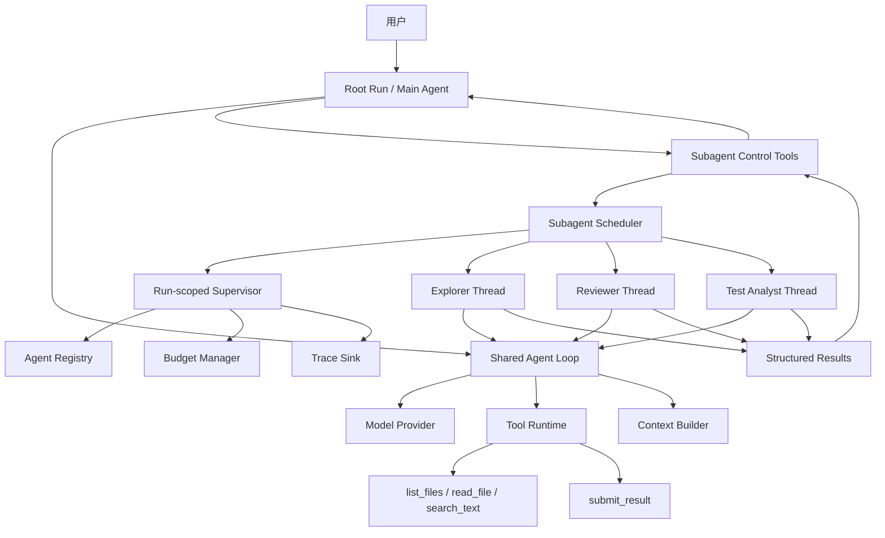

# Harness Agent 项目：阶段 2 Subagent Runtime 详细设计

> 文档版本：v0.1  
> 文档日期：2026-07-11  
> 前置文档：
> - `Harness_Agent_阶段0总体设计.md`
> - `Harness_Agent_阶段1单Agent详细设计.md`
>
> 当前阶段：阶段 2——Subagent Runtime  
> 文档性质：实施前详细设计，不包含正式业务代码  
> 主要用途：供 Codex 按照明确边界实现 Main Agent + Subagent as Tool  
> 启动条件：阶段 1 的单 Agent Loop、Tool Runtime、Fake Provider、Trace 和 Workspace Boundary 已通过验收

---

## 1. 阶段 2 的目标

阶段 2 要在阶段 1 的单 Agent Harness 上增加一个真正可管理的 Subagent Runtime。

目标不是简单实现：

```python
result = await run_agent(prompt)
```

而是建立一套具备明确运行语义的子 Agent 线程系统：

```text
Main Agent
    ↓
spawn_subagent
    ↓
创建独立 Agent Thread
    ↓
子 Agent 使用自己的上下文、工具、预算和输出协议运行
    ↓
Main Agent 可以查看状态、追加指令、等待、取消和关闭
    ↓
子 Agent 返回经过校验的结构化结果
    ↓
Main Agent 汇总结果并继续完成用户任务
```

阶段 2 完成后，系统应当具备以下核心能力：

```text
Agent Registry
Agent Thread
Subagent Scheduler
Subagent Control Tools
Fresh Context Isolation
Per-Agent Tool Filtering
Per-Agent Budget
Parallel Child Execution
Structured Child Result
Parent-Child Trace
Cancellation Propagation
Follow-up and Reuse
No Orphan Agent Guarantee
```

阶段 2 仍然不实现长期记忆、Skill、MCP、HITL、完整权限引擎、Docker Sandbox、文件写入和持久恢复。

---

## 2. 参考系统与设计依据

### 2.1 Codex Subagents

Codex 的多 Agent 控制包括：

```text
spawn
route follow-up instructions
wait for results
stop
close agent threads
```

多个子 Agent 可以并行执行，主线程等待所需结果后统一整理。Codex 还通过全局配置限制并发线程和嵌套深度；官方当前默认 `max_threads = 6`、`max_depth = 1`，并建议除非确有需要，不要轻易提高嵌套深度，因为递归委派会增加 Token、延迟和本地资源消耗。[R1]

Codex 还强调：

- 子 Agent 适合代码探索、测试分析、日志分析和独立审查；
- 子 Agent 应返回精炼结果，而不是把全部中间过程塞回主线程；
- 并行写任务容易产生冲突，读密集任务更适合作为早期多 Agent 场景。[R1]

**本项目借鉴：**

- 采用 Agent Thread，而不是一次性同步函数；
- 提供 `spawn / wait / send_followup / cancel / close`；
- 第一版默认仅允许 Root 创建直接子 Agent；
- 设置并发和总创建数量限制；
- 阶段 2 只验证只读、可并行任务；
- Main Agent 只接收结构化摘要和结果引用。

### 2.2 Claude Code Subagents

Claude Code 的每个 Subagent：

- 使用独立上下文窗口；
- 拥有自定义系统提示词；
- 可以限制工具；
- 可以使用独立权限；
- 默认不会看到父对话历史、父 Agent 已经读取的文件或已经调用的 Skill；
- 父 Agent 通过委派消息向它传递当前任务所需信息。[R2]

这种机制的主要目的之一，是让搜索结果、日志和大量文件内容保留在子 Agent 自己的上下文中，只把总结返回主对话。

**本项目借鉴：**

- 子 Agent 默认从全新消息历史开始；
- 不复制父 Agent 完整历史；
- 通过显式 Delegation Context Packet 传递任务；
- 每种子 Agent 使用明确的系统提示词和工具白名单；
- 子 Agent 的原始 Tool 日志只存在于其自己的 Trace 和历史中。

### 2.3 OpenAI Agents SDK：Agent as Tool

OpenAI Agents SDK 支持把一个 Agent 暴露为 Tool，而不发生 Handoff。外层 Agent 保持控制权；嵌套 Agent 可以拥有结构化输入、结构化输出和独立的运行过程。[R3]

它还表明：

- 外层 Run 应统一拥有审批、Trace 和中断语义；
- 嵌套 Agent 内部的审批仍可冒泡到外层 Run；
- 嵌套 Agent 可以共享应用运行上下文，但会拥有自己的对话执行过程。[R4][R5]

**本项目借鉴：**

- Subagent 是 Tool Runtime 可调用的一类内部能力；
- Root Run 是用户任务的顶层边界；
- 子 Agent 的运行、用量和异常都归属于 Root Run；
- 未来阶段的审批应统一冒泡到 Root Run；
- 本阶段明确区分共享的不可变运行依赖与隔离的 Agent 消息状态。

### 2.4 LangChain Supervisor / Subagents

LangChain 的 Subagent 模式具备：

- 中心化控制；
- 所有路由经过 Main Agent；
- 子 Agent 不直接面向用户；
- 子 Agent 通过 Tool 调用；
- Main Agent 可以在同一轮请求多个子 Agent；
- Supervisor 是持有多轮上下文的完整 Agent，不是一次性的 Router。[R6]

**本项目借鉴：**

- Main Agent 是持续运行的 Orchestrator；
- Subagent 不直接回复用户；
- 子 Agent 控制工具作为 Main Agent 的 Tool；
- 同一模型轮次返回多个 `spawn_subagent` 时，允许真正并行运行。

### 2.5 Python asyncio

Python 的 `asyncio.TaskGroup` 提供结构化并发：任务由明确作用域持有，退出作用域时会等待任务完成；取消通过 `CancelledError` 传播，协程应在清理后继续传播取消，而不能静默吞掉。[R7]

**本项目借鉴：**

- 每个 Root Run 创建一个 Subagent Supervisor 作用域；
- 所有子 Agent Task 都归属于该 Root Run；
- Root Run 结束前必须等待或取消全部子任务；
- 不能产生脱离 Root Run 生命周期的后台 Agent；
- 子 Agent 协程必须正确处理和传播取消。

---

## 3. 阶段 2 的范围

### 3.1 本阶段必须实现

1. Agent Definition 扩展；
2. Agent Registry；
3. Agent Thread / Agent Turn 数据模型；
4. Delegation Request；
5. Delegation Context Packet；
6. Subagent Result Envelope；
7. Subagent Scheduler；
8. Root Run 级 Subagent Supervisor；
9. 子 Agent 并发执行；
10. 子 Agent 工具白名单；
11. 子 Agent 独立消息历史；
12. 子 Agent 模型与预算配置；
13. `spawn_subagent`；
14. `wait_subagents`；
15. `get_subagent_status`；
16. `send_subagent_message`；
17. `cancel_subagent`；
18. `close_subagent`；
19. 子 Agent 结构化完成协议；
20. 父子 Trace；
21. Root Run 取消向下传播；
22. 子 Agent 异常隔离；
23. Root Run 完成前无活动子 Agent检查；
24. Fake Provider 多 Agent 测试；
25. 多 Agent Demo；
26. 阶段 2 README 和验收报告。

### 3.2 本阶段明确不实现

```text
A2A Agent 自由通信
Handoff
子 Agent 直接与用户对话
两层以上嵌套
长期 Memory
Agent Memory
Skill
MCP
HITL Approval
完整 Permission Engine
Docker Sandbox
写文件
Apply Patch
通用 Shell
Git Worktree
多写 Agent 冲突处理
跨进程 Subagent
后台 Agent 脱离 Root Run
Checkpoint 持久恢复
程序重启后恢复子 Agent
数据库任务队列
分布式调度
Web UI Agent 面板
```

阶段 2 只在现有只读 Workspace Tool 上验证 Subagent Runtime。

---

## 4. 阶段 2 的核心架构决策

### ADR-201：采用 Agent Thread，而不是单次 Agent 函数

一个子 Agent 不是只有一次返回值的函数，而是一个在 Root Run 内可被管理的 Agent Thread。

它支持：

```text
spawn
observe
wait
send follow-up
cancel
close
```

原因：

- 更接近 Codex 的实际控制模型；
- 支持后续追加任务；
- 支持等待多个 Agent；
- 支持取消和状态检查；
- 为未来 Checkpoint 和 UI 奠定状态基础。

### ADR-202：Root Run 是唯一顶层任务边界

用户提交一次任务，只创建一个 Root Run。

Root Run 内包含：

```text
Root Agent Thread
Child Agent Threads
Delegation Tasks
Shared Budget
Shared Trace
Shared Workspace Metadata
```

子 Agent 不创建新的用户级 Run ID。

每个子 Agent 拥有：

```text
agent_id
thread_id
turn_id
parent_agent_id
```

所有事件仍关联同一个 `run_id`。

### ADR-203：复用阶段 1 的 Agent Loop

不能为子 Agent 再写一套独立循环。

阶段 2 应将阶段 1 的 Agent Loop 提炼为：

```text
run_agent_turn(
    agent_thread,
    input,
    completion_policy,
    runtime_context,
)
```

Root Agent 和 Subagent 均使用同一个 Agent Loop：

```text
Root Agent:
    TextFinalCompletionPolicy

Subagent:
    StructuredSubagentCompletionPolicy
```

二者差异通过配置和 Completion Policy 体现，不通过复制代码实现。

### ADR-204：子 Agent 默认全新上下文

子 Agent 不继承：

- 父 Agent 完整对话；
- 父 Agent 的 Tool Result；
- 父 Agent 已读取的所有文件；
- 父 Agent 的模型原始输出；
- 其他子 Agent 的消息历史。

子 Agent只接收经过构造的 Delegation Context Packet。

### ADR-205：子 Agent 使用静态 Agent Definition

Main Agent 只能从 Agent Registry 中选择已注册角色：

```text
explorer
reviewer
dependency_analyst
test_analyst
```

Main Agent 不允许在 Tool 参数中传入任意 System Prompt、任意 Tool 列表或任意权限。

Main Agent 可以指定：

```text
agent_name
task
context
expected_focus
budget_override（受限）
```

最终配置由 Scheduler 根据 Agent Definition 计算。

### ADR-206：第一版只允许一层子 Agent

配置：

```yaml
max_depth: 1
```

含义：

```text
Root Agent depth = 0
Child Agent depth = 1
```

Child Agent 不获得 Subagent Control Tools。

即使恶意 Prompt 要求 Child Agent 创建新 Agent，系统也没有向其暴露相应能力。

### ADR-207：Spawn 非阻塞，Wait 显式等待

`spawn_subagent`：

- 创建 Agent Thread；
- 调度执行；
- 立即返回 Agent Handle；
- 不等待结果。

Main Agent 可以在同一模型响应中请求多个 Spawn。

阶段 1 的 Tool Runtime 即使顺序执行多个 Spawn Tool Call，由于每个 Spawn 很快返回并把工作交给 Scheduler，这些子 Agent仍会并行运行。

Main Agent 随后通过：

```text
wait_subagents
```

等待一个或多个结果。

### ADR-208：并发使用 Root Run 级结构化作用域

每个 Root Run 创建一个：

```text
SubagentSupervisor
```

Supervisor 持有：

- TaskGroup；
- Agent Thread Runtime Handles；
- 并发 Semaphore；
- 状态变更 Condition；
- Root Cancellation Signal。

所有子任务必须在 Supervisor 作用域内创建。

Root Run 结束时：

```text
取消所有仍在运行的子 Agent
等待清理完成
然后才能结束 Root Run
```

不允许 orphan task。

### ADR-209：子 Agent 异常不自动取消兄弟 Agent

`asyncio.TaskGroup` 默认会在任务异常逃出时取消其他任务。

因此每个子 Agent Task 必须由 Scheduler Wrapper 捕获普通异常，并转换成：

```text
AgentTurn = FAILED
AgentThread = IDLE 或 FAILED
SubagentResult(status="failed")
Trace Event
```

普通子 Agent 失败不能向 TaskGroup 泄漏。

`asyncio.CancelledError` 必须在清理后重新抛出，以保留取消语义。

### ADR-210：结构化结果通过终止 Tool 提交

子 Agent不能只返回一段不受约束的自然语言。

每种 Subagent Definition 绑定一个 Output Model。

Scheduler 为子 Agent 注入内部终止工具：

```text
submit_result
```

其输入 Schema 来自 Agent Definition 的 Output Model。

运行流程：

```text
子 Agent 调用 submit_result
    ↓
Tool Runtime 本地 Schema 校验
    ↓
生成 Terminal Control Signal
    ↓
当前 Agent Turn 成功结束
    ↓
结果保存到 SubagentResult
```

该工具不执行外部副作用。

如果子 Agent直接返回普通文本但没有调用 `submit_result`：

1. Runtime 向其追加一次格式修正消息；
2. 允许有限次数修正；
3. 修正仍失败则 Agent Turn 进入 `OUTPUT_VALIDATION_FAILED`。

### ADR-211：子 Agent 结果只向父 Agent 返回精炼内容

Main Agent 的 `wait_subagents` Tool Result 包含：

```text
agent_id
agent_name
status
summary
structured_data
evidence
unresolved_questions
confidence
result_ref
usage_summary
```

不返回：

- 子 Agent 完整消息历史；
- 所有模型响应；
- 所有 Tool Result；
- 原始 Trace；
- 大段重复文件内容。

这些信息仍可通过 Trace 和结果文件检查。

### ADR-212：运行中 Follow-up 使用 Mailbox

每个 Agent Thread 有一个父指令 Mailbox。

`send_subagent_message`：

- 如果 Thread 正在 RUNNING：消息进入 Mailbox；
- Agent Loop 在安全边界——下一次 Model Call 前——取出消息并追加到子 Agent 历史；
- 不强制中断正在进行的 Provider 请求或 Tool Call；
- 如果 Thread 为 IDLE：创建新 Agent Turn并继续同一 Thread；
- 如果 Thread 已 CLOSED 或 CANCELLED：拒绝。

### ADR-213：Root Agent 不得在子 Agent 活动时完成

如果 Root Agent 尝试给出最终答案，但仍存在：

```text
QUEUED
RUNNING
CANCELLING
```

状态的子 Agent，Root Completion Guard 不允许结束。

Runtime 向 Root Agent追加可见反馈：

```text
Active subagents remain. Wait for them or cancel them before finishing.
```

避免子 Agent 成为孤儿，也避免结果被忽略。

### ADR-214：阶段 2 不支持跨进程恢复

Agent Thread、TaskGroup、Mailbox 和 Provider Task 都是当前进程内对象。

程序退出后：

```text
所有正在运行的 Subagent 丢失
Root Run 不可恢复
```

这一限制必须明确写入 README。

持久恢复属于阶段 6。

---

## 5. 阶段 2 总体架构



---

## 6. 推荐目录调整

在阶段 1 项目上增加，不创建阶段 3 以后的空壳模块。

```text
agent-harness/
├── agents/
│   ├── main.toml
│   ├── explorer.toml
│   ├── reviewer.toml
│   ├── dependency-analyst.toml
│   └── test-analyst.toml
│
├── src/
│   └── agent_harness/
│       ├── domain/
│       │   ├── agent.py
│       │   ├── run.py
│       │   ├── subagents.py          # 新增
│       │   ├── delegation.py         # 新增
│       │   └── events.py
│       │
│       ├── agents/                   # 新增
│       │   ├── __init__.py
│       │   ├── definitions.py
│       │   ├── registry.py
│       │   ├── loader.py
│       │   └── outputs.py
│       │
│       ├── runtime/
│       │   ├── agent_loop.py         # 重构为 Root/Child 共用
│       │   ├── completion.py         # 新增
│       │   ├── run_manager.py
│       │   ├── budgets.py
│       │   └── subagents/            # 新增
│       │       ├── __init__.py
│       │       ├── scheduler.py
│       │       ├── supervisor.py
│       │       ├── thread.py
│       │       ├── mailbox.py
│       │       ├── context_packet.py
│       │       └── control_tools.py
│       │
│       ├── context/
│       │   ├── builder.py
│       │   └── delegation.py         # 新增
│       │
│       ├── tools/
│       │   ├── runtime.py
│       │   ├── registry.py
│       │   └── internal/             # 新增
│       │       └── submit_result.py
│       │
│       └── tracing/
│           ├── sink.py
│           ├── jsonl.py
│           └── summary.py
│
├── tests/
│   ├── unit/
│   │   ├── test_agent_registry.py
│   │   ├── test_subagent_scheduler.py
│   │   ├── test_subagent_supervisor.py
│   │   ├── test_subagent_control_tools.py
│   │   ├── test_delegation_context.py
│   │   ├── test_structured_result.py
│   │   ├── test_followup_mailbox.py
│   │   ├── test_subagent_budget.py
│   │   └── test_subagent_trace.py
│   ├── integration/
│   │   ├── test_parallel_repository_analysis.py
│   │   ├── test_child_failure_isolation.py
│   │   └── test_root_cancellation.py
│   └── live/
│       └── test_deepseek_subagents_live.py
│
└── .harness/
    └── runs/
        └── <run_id>/
            ├── events.jsonl
            ├── result.json
            └── agents/
                └── <agent_id>/
                    ├── thread.json
                    ├── turn-0001-result.json
                    └── turn-0002-result.json
```

注意：

- Agent 配置放在 `agents/`；
- 不创建 `memory/`、`skills/`、`mcp/`、`sandbox/`；
- 子 Agent 结果文件不是完整 Artifact Store；
- 全局 Trace 仍以 Root Run 的 `events.jsonl` 为事实记录。

---

## 7. 核心领域模型

### 7.1 AgentDefinition

阶段 1 的 AgentDefinition 扩展为：

```text
AgentDefinition
├── name
├── description
├── system_prompt
├── model_policy
├── allowed_tools
├── can_spawn_subagents
├── max_depth
├── default_budget
├── output_schema_id
├── context_policy
└── metadata
```

规则：

- `name` 全局唯一；
- `description` 用于 Main Agent 判断何时委派；
- `allowed_tools` 是显式白名单；
- Child Agent 默认 `can_spawn_subagents = false`；
- `output_schema_id` 必须能在 Output Registry 中找到；
- AgentDefinition 是不可变配置；
- 运行时覆盖只能缩小能力，不能扩大。

### 7.2 AgentRegistry

负责：

```text
register
load_from_toml
get
list_for_parent
validate
export_agent_tool_descriptions
```

启动时校验：

- Agent 名称唯一；
- Tool 均存在；
- Output Schema 存在；
- Child Agent 不声明未实现能力；
- Model Provider 可用；
- `max_depth` 不超过系统全局限制；
- 不允许配置循环继承。

### 7.3 AgentThreadState

一个可复用的 Agent Thread：

```text
AgentThreadState
├── agent_id
├── thread_id
├── run_id
├── parent_agent_id
├── agent_definition_name
├── depth
├── status
├── task
├── message_history
├── current_turn_id
├── turn_count
├── mailbox_size
├── created_at
├── updated_at
├── last_result
├── cumulative_usage
├── error
└── closed_at
```

Thread 状态：

```text
CREATED
QUEUED
RUNNING
IDLE
CANCELLING
CANCELLED
FAILED
CLOSED
```

说明：

- `IDLE` 表示当前 Turn 已结束，但 Thread 仍可接受 Follow-up；
- `FAILED` 表示 Thread 出现不可恢复的内部错误；
- 某一次业务任务失败不一定让 Thread 进入 FAILED，可以让 Turn 失败后 Thread 回到 IDLE；
- `CLOSED` 后不可重新启动。

### 7.4 AgentTurnState

每次初始任务或 Follow-up 都创建一个 Turn：

```text
AgentTurnState
├── turn_id
├── agent_id
├── sequence
├── input_message
├── status
├── started_at
├── completed_at
├── result
├── usage
├── model_call_count
├── tool_call_count
└── error
```

Turn 状态：

```text
CREATED
RUNNING
SUCCEEDED
FAILED
CANCELLED
```

### 7.5 DelegationRequest

由 `spawn_subagent` Tool Call 构造：

```text
DelegationRequest
├── request_id
├── parent_agent_id
├── agent_name
├── task
├── context
├── expected_focus
├── budget_override
├── tool_call_id
└── idempotency_key
```

限制：

- `task` 必填且有最大字符数；
- `context` 有严格长度限制；
- `agent_name` 必须来自 Registry；
- 不接受任意 System Prompt；
- 不接受任意 Tool 列表；
- 不接受任意权限；
- Budget Override 只能低于 AgentDefinition 和全局上限。

### 7.6 DelegationContextPacket

Scheduler 构建并发送给 Child：

```text
DelegationContextPacket
├── root_task
├── delegated_task
├── parent_summary
├── explicit_context
├── expected_focus
├── constraints
├── workspace_metadata
├── allowed_tools_summary
├── output_contract
├── budget_summary
└── trace_identifiers
```

默认不包含：

```text
父 Agent 完整消息历史
父 Agent 全部 Tool Results
其他 Child Agent 历史
Provider 原始对象
API Key
环境变量
```

### 7.7 SubagentResult

所有角色共用外层 Envelope：

```text
SubagentResult
├── agent_id
├── agent_name
├── turn_id
├── status
├── summary
├── data
├── evidence
├── unresolved_questions
├── confidence
├── warnings
├── usage
├── result_ref
└── error
```

其中：

```text
data
```

由不同 Agent 的 Output Model 决定。

### 7.8 SubagentHandle

`spawn_subagent` 返回：

```text
SubagentHandle
├── agent_id
├── thread_id
├── agent_name
├── status
├── depth
├── created_at
└── task_preview
```

Handle 不包含可修改的 Runtime 对象。

---

## 8. Agent 定义建议

阶段 2 只使用只读角色。

### 8.1 Main Agent

```yaml
name: main
description: Root orchestrator responsible for the user task.

allowed_tools:
  - list_files
  - read_file
  - search_text
  - spawn_subagent
  - wait_subagents
  - get_subagent_status
  - send_subagent_message
  - cancel_subagent
  - close_subagent

can_spawn_subagents: true
max_depth: 1
output_schema_id: none
```

### 8.2 Explorer

职责：

```text
快速定位文件、符号、调用关系和相关实现。
```

工具：

```text
list_files
read_file
search_text
submit_result
```

输出示例：

```text
ExplorerResult
├── summary
├── relevant_files[]
├── symbols[]
├── call_flow[]
├── evidence[]
├── unresolved_questions[]
└── confidence
```

### 8.3 Reviewer

职责：

```text
基于明确范围检查正确性、边界情况、维护性和潜在缺陷。
```

工具：

```text
read_file
search_text
submit_result
```

输出：

```text
ReviewerResult
├── summary
├── findings[]
├── severity_summary
├── missing_tests[]
├── evidence[]
└── confidence
```

### 8.4 Dependency Analyst

职责：

```text
分析模块依赖、导入路径和受影响范围。
```

### 8.5 Test Analyst

职责：

```text
只读分析现有测试结构、测试缺口和建议验证点。
```

阶段 2 不提供命令执行，因此 Test Analyst 只能分析测试代码，不声称实际运行了测试。

---

## 9. Subagent Control Tools

所有 Control Tool 只向符合条件的父 Agent 暴露。

### 9.1 spawn_subagent

输入：

```text
agent_name
task
context?
expected_focus?
budget_override?
client_request_id?
```

流程：

```text
校验调用者深度和能力
    ↓
校验 AgentDefinition
    ↓
计算 idempotency_key
    ↓
检查重复 Spawn
    ↓
检查总数量与并发预算
    ↓
创建 AgentThreadState
    ↓
构造 Delegation Context Packet
    ↓
在 Supervisor 中调度
    ↓
立即返回 SubagentHandle
```

幂等规则：

```text
idempotency_key =
run_id + parent_agent_id + tool_call_id
```

同一 Tool Call 重放时，不允许重复创建 Agent。

### 9.2 wait_subagents

输入：

```text
agent_ids[]
mode: all | any
timeout_seconds?
```

语义：

#### mode = all

等待所有指定 Agent 的当前 Turn 到达终态：

```text
SUCCEEDED
FAILED
CANCELLED
```

#### mode = any

任意一个指定 Agent 当前 Turn 到达终态即返回。

超时：

- 不取消 Agent；
- 返回当前快照；
- `timed_out = true`；
- Main Agent 可以继续做其他事或再次等待。

输出：

```text
WaitResult
├── completed[]
├── pending[]
├── failed[]
├── cancelled[]
├── timed_out
└── elapsed_ms
```

### 9.3 get_subagent_status

输入：

```text
agent_ids?   # 为空时列出当前 Root Run 下全部 Child
```

输出：

```text
agent_id
agent_name
thread_status
current_turn_status
task_preview
turn_count
elapsed
usage
last_result_preview
```

不返回完整消息历史。

### 9.4 send_subagent_message

输入：

```text
agent_id
message
```

语义：

#### Thread = RUNNING

```text
将消息放入 Mailbox
下一次 Model Call 前注入
```

#### Thread = IDLE

```text
创建新 Turn
沿用该 Thread 的历史
追加父 Agent 消息
重新调度
```

#### Thread = QUEUED

```text
消息进入 Mailbox
首次运行前一并注入
```

#### Thread = CLOSED / CANCELLED / FAILED

拒绝并返回明确错误。

消息元数据：

```text
origin = parent_followup
parent_agent_id
timestamp
```

### 9.5 cancel_subagent

输入：

```text
agent_id
reason?
```

流程：

```text
标记 CANCELLING
    ↓
取消对应 asyncio Task
    ↓
Child 执行 finally 清理
    ↓
Turn = CANCELLED
Thread = CANCELLED
    ↓
记录 Trace
```

取消必须是幂等的。

再次取消已取消 Agent，返回当前状态而不是报内部错误。

### 9.6 close_subagent

输入：

```text
agent_id
force: false
```

规则：

- `IDLE`、`CANCELLED`、业务 Turn 失败后可关闭；
- `RUNNING` 默认拒绝；
- `force = true` 时先取消，再关闭；
- `CLOSED` 幂等；
- 关闭后保留 Trace 和结果文件；
- 关闭释放 Thread Slot，但不返还已消费的 Token。

---

## 10. Agent Loop 的阶段 2 重构

### 10.1 统一 Agent Turn 接口

建议抽象：

```text
AgentLoop.run_turn(
    thread_state,
    input_message,
    runtime_context,
    completion_policy,
) -> AgentTurnResult
```

### 10.2 RuntimeContext

阶段 2 明确拆分：

```text
SharedRunContext
├── run_id
├── workspace_root
├── provider_factory
├── tool_registry
├── trace_sink
├── global_budget_manager
└── cancellation_signal

AgentLocalContext
├── agent_id
├── thread_id
├── parent_agent_id
├── agent_definition
├── message_history
├── local_budget
├── mailbox
└── completion_policy
```

共享部分不包含可由 Child 随意修改的 Root State。

### 10.3 Root Completion Policy

Root Agent：

```text
无 Tool Call + 非空文本
+
不存在活动子 Agent
=
Root Turn 完成
```

如果仍存在活动子 Agent：

```text
拒绝 Final
追加运行时反馈
继续下一轮
```

### 10.4 Structured Subagent Completion Policy

Child Agent：

```text
必须调用 submit_result
```

`submit_result` 返回：

```text
TerminalControlSignal(
    kind = "agent_completed",
    payload = validated_output
)
```

Agent Loop 收到 Terminal Control Signal 后：

- 不再把 Tool Result 发回模型；
- 当前 Turn 直接 SUCCEEDED；
- 保存结构化结果；
- Thread 进入 IDLE。

### 10.5 输出修正

如果 Child 返回普通最终文本：

```text
第一次：
追加“请使用 submit_result 提交符合 Schema 的结果”

第二次：
再次允许模型修正

超过 max_output_repair_attempts：
Turn FAILED
error = OUTPUT_VALIDATION_FAILED
```

默认：

```yaml
max_output_repair_attempts: 2
```

---

## 11. 子 Agent 上下文隔离

### 11.1 初始消息

新 Child Thread 的消息：

```text
system:
    AgentDefinition.system_prompt

user:
    Delegation Context Packet
```

不复制父历史。

### 11.2 Context Packet 长度限制

建议：

```yaml
delegation:
  max_task_chars: 8000
  max_context_chars: 16000
  max_parent_summary_chars: 8000
```

超过限制时拒绝 Spawn，而不是静默截断关键任务。

### 11.3 父 Agent 应传什么

适合传递：

- 明确任务；
- 目标文件范围；
- 已确认事实；
- 需要回答的问题；
- 相关路径和符号；
- 输出重点；
- 用户约束。

不适合传递：

- 父 Agent 全部对话；
- 无关 Tool 日志；
- 大量重复代码；
- 不确定但未标记的推断；
- Secret。

### 11.4 Follow-up 历史

同一 Thread 的 Follow-up 会继续使用自己的历史。

不同 Thread 之间绝不共享消息历史。

### 11.5 Main Agent 接收结果

Main Agent 只接收：

```text
Wait Tool Result
```

其内容由 Scheduler 生成，不直接使用 Child 的最后一条原始模型消息。

---

## 12. 调度与并发模型

### 12.1 默认限制

本项目建议初始配置：

```toml
[subagents]
max_depth = 1
max_concurrent = 4
max_total_per_run = 12
default_timeout_seconds = 300
max_turns_per_thread = 4
```

这些是本项目初始参数，不是 Codex 官方默认值。

### 12.2 并发 Slot

- `max_concurrent` 只计算 QUEUED/RUNNING Child；
- Root Agent 不占 Child Slot；
- IDLE Thread 不占执行 Slot，但受 Open Thread 数限制；
- 可以额外设置 `max_open_threads`，初始与 `max_total_per_run` 相同。

### 12.3 排队

达到并发上限后：

```text
AgentThread = QUEUED
```

按创建顺序获得 Slot。

阶段 2 不实现优先级队列。

### 12.4 Supervisor 生命周期

```text
Root Run Started
    ↓
enter SubagentSupervisor
    ↓
动态 spawn child tasks
    ↓
Root 完成 / 失败 / 取消
    ↓
取消仍活动 Child
    ↓
等待 Child 清理
    ↓
exit Supervisor
    ↓
Root Run 终止
```

### 12.5 TaskGroup 包装

每个 Child 执行入口：

```text
try:
    execute child turn
except CancelledError:
    update cancelled state
    raise
except Exception:
    convert to failed result
    do not re-raise
finally:
    release semaphore
    notify waiters
    flush trace
```

这样普通 Child 异常不会让 TaskGroup 自动取消兄弟 Agent。

### 12.6 Wait 实现

Scheduler 维护：

```text
asyncio.Condition
```

任何 Thread / Turn 状态变化都：

```text
notify_all()
```

`wait_subagents` 在 Condition 上等待目标状态变化，而不是高频轮询。

---

## 13. Budget 设计

### 13.1 两级预算

```text
Root Run Global Budget
+
Per-Agent Local Budget
```

Global Budget 包括：

```text
max_total_model_calls
max_total_tool_calls
max_total_tokens
max_total_wall_time
max_total_subagents
```

Local Budget 包括：

```text
max_model_calls
max_tool_calls
max_tokens
max_wall_time
```

### 13.2 有效预算

```text
effective_child_budget
=
min(
    AgentDefinition.default_budget,
    parent_request_override,
    remaining_global_budget
)
```

Parent 只能缩小预算，不能扩大。

### 13.3 预算预留

并发 Spawn 时应避免所有 Child 都认为自己拥有全部剩余预算。

Scheduler 在 Spawn 时通过异步锁预留：

```text
model call allowance
tool call allowance
token allowance（若配置硬上限）
```

Child 完成后：

- 已使用部分计入 Global Usage；
- 未使用预留返还；
- 已消费 Token 不返还。

### 13.4 超限行为

Child Local Budget 超限：

```text
Child Turn = FAILED
SubagentResult.error = LOCAL_BUDGET_EXCEEDED
Root Run 继续
```

Global Budget 超限：

```text
停止新 Spawn
取消或阻止后续执行
Root Run = FAILED / LIMIT_REACHED
```

是否立即取消已经运行的 Child，由具体 Global Limit 决定：

- Global Wall Time：取消全部；
- Global Token Hard Limit：阻止下一次模型调用；
- Max Total Subagents：仅拒绝新 Spawn。

---

## 14. 取消与失败传播

### 14.1 Root 取消

```text
Root cancellation requested
    ↓
Supervisor cancel_all()
    ↓
所有 Child Task cancel()
    ↓
等待清理
    ↓
Root Run CANCELLED
```

### 14.2 Child 取消

只取消目标 Child，不影响兄弟 Agent 或 Root。

Main Agent 通过 Wait Result 看到：

```text
status = cancelled
```

### 14.3 Child 业务失败

例如：

- 找不到文件；
- 结构化输出修正失败；
- Child Local Budget 超限；
- Provider 重试耗尽。

结果：

```text
Child Turn FAILED
Thread IDLE 或 FAILED
Root Run 继续
```

Main Agent 决定：

- 重新委派；
- 发送 Follow-up；
- 换 Agent；
- 自己继续；
- 向用户说明失败。

### 14.4 Child 内部不变量损坏

例如：

- Thread State 与 Task Handle 丢失对应；
- Result 属于错误 Agent；
- Runtime Handle 重复；
- Trace sequence 无法保证。

结果：

```text
Thread FAILED
可能升级为 Root Run FAILED
```

是否升级由错误类别决定。

### 14.5 Root Provider 失败

Root Agent 失败时必须取消全部 Child，再结束 Root Run。

---

## 15. Follow-up 与线程复用

### 15.1 为什么需要 Follow-up

主 Agent 可能收到不完整结果：

```text
请进一步检查 payments.py 中的重试逻辑。
```

不应总是新建 Child，因为原 Child 已经拥有相关上下文。

### 15.2 Running Thread Follow-up

消息进入 Mailbox。

Agent Loop 在以下安全点读取：

```text
每次 Context Build 前
每批 Tool Result 写回后
```

不在以下时点强行注入：

```text
Provider 请求进行中
Tool 执行进行中
submit_result 已完成后但状态尚未提交
```

### 15.3 Idle Thread Follow-up

创建新 Turn：

```text
Thread IDLE
    ↓
append parent_followup message
    ↓
Turn N+1 CREATED
    ↓
重新进入 Scheduler
    ↓
Thread RUNNING
```

### 15.4 Follow-up 限制

```yaml
max_turns_per_thread: 4
max_followup_message_chars: 8000
```

超过后应新建 Agent，而不是无限延长同一 Thread。

---

## 16. 结构化输出设计

### 16.1 通用字段

所有 Output Model 都应包含：

```text
summary
evidence
unresolved_questions
confidence
```

### 16.2 Evidence

```text
EvidenceItem
├── path
├── start_line
├── end_line
├── claim
└── excerpt?
```

要求：

- 路径必须位于 Workspace；
- 行号必须为正数；
- excerpt 有长度限制；
- Evidence 不能声称来自未读取文件；
- 第一版仅做结构校验，不做自动事实验证。

### 16.3 Confidence

范围：

```text
0.0 ~ 1.0
```

Confidence 只是子 Agent 自报，不作为安全或正确性保证。

### 16.4 Result 文件

路径：

```text
.harness/runs/<run_id>/agents/<agent_id>/turn-<n>-result.json
```

Root Tool Result 返回：

```text
result_ref
```

### 16.5 Tool Result 大小

`wait_subagents` 返回内容必须受限。

建议：

```yaml
max_result_summary_chars_per_agent: 6000
max_wait_tool_result_chars: 24000
```

超过时：

- 保留 summary；
- data 进行字段级裁剪；
- 返回 result_ref；
- 明确 `truncated = true`。

---

## 17. Trace 设计

### 17.1 基础字段扩展

阶段 1 Event 增加：

```text
agent_id
thread_id
turn_id
parent_agent_id
delegation_request_id
depth
```

### 17.2 阶段 2 新事件

```text
agent.spawn_requested
agent.spawn_reused
agent.spawned
agent.queued
agent.started
agent.idle
agent.followup_enqueued
agent.followup_started
agent.wait_started
agent.wait_completed
agent.cancel_requested
agent.cancelled
agent.closed
agent.failed

agent.result_submitted
agent.result_validation_failed
agent.output_repair_requested

agent.budget_reserved
agent.budget_released
agent.budget_exceeded

supervisor.started
supervisor.cancelling_all
supervisor.completed
```

### 17.3 全局顺序

所有 Root 和 Child 并发事件写入同一个：

```text
events.jsonl
```

Trace Sink 必须使用异步锁分配全局单调 `sequence_number`。

不能让每个 Agent 自己生成相互冲突的序号。

### 17.4 父子关联

`agent.spawned` Event 是 Child 顶层事件的父事件。

Child 的：

```text
model.requested
tool.requested
agent.result_submitted
```

均通过 `agent_id`、`parent_agent_id` 和 `parent_event_id` 关联。

### 17.5 最终 Result Summary

Root `result.json` 增加：

```text
agent_summary:
  total_spawned
  max_concurrent_observed
  succeeded
  failed
  cancelled
  closed
  total_child_model_calls
  total_child_tool_calls
  total_child_tokens
  agent_tree[]
```

---

## 18. Fake Provider 与测试支持

### 18.1 多 Agent Script

Fake Provider 必须支持按以下维度分配脚本：

```text
agent_definition_name
agent_id
turn_sequence
model_call_sequence
```

示例：

```text
main:
  call 1 -> spawn explorer
  call 2 -> spawn reviewer
  call 3 -> wait all
  call 4 -> final answer

explorer:
  call 1 -> search_text
  call 2 -> read_file
  call 3 -> submit_result

reviewer:
  call 1 -> read_file
  call 2 -> submit_result
```

### 18.2 可控延迟

Fake Provider 和 Fake Tool 支持：

```text
delay_seconds
```

用于验证：

- Child 真正并发；
- Wait any；
- Wait timeout；
- Cancel；
- Root completion guard。

### 18.3 可控失败

支持注入：

```text
Provider Error
Tool Error
Invalid structured output
CancelledError
Unexpected Exception
Budget Exhaustion
```

---

## 19. 测试策略

### 19.1 Agent Registry

必须覆盖：

- 正常加载；
- 重复 Agent Name；
- 不存在 Tool；
- 不存在 Output Schema；
- Child 非法启用 Spawn；
- 配置试图扩大系统深度；
- 非法模型配置；
- TOML 解析错误。

### 19.2 Spawn

必须覆盖：

1. Root 成功 Spawn；
2. Child 无法 Spawn；
3. 不存在 Agent；
4. 超过 max_total；
5. 超过 max_depth；
6. 并发满后进入 QUEUED；
7. 同一 Tool Call 重放不重复创建；
8. Budget Override 只能缩小；
9. Context 超长；
10. Agent Handle 正确。

### 19.3 Context Isolation

验证：

- Child 看不到父完整历史；
- Child 看不到父 Tool Result；
- Child 能看到 Delegation Packet；
- 两个 Child 历史互不相同；
- Follow-up 只进入目标 Thread；
- Agent 工具白名单正确；
- Child 不存在 Spawn Tool。

### 19.4 并发

验证：

- 两个 Child 同时运行；
- max_concurrent 生效；
- QUEUED 按顺序启动；
- Child 普通异常不取消兄弟；
- Supervisor 退出前无活动 Task；
- max_concurrent_observed 正确。

### 19.5 Wait

验证：

- wait all；
- wait any；
- timeout 不取消；
- 等待不存在 Agent；
- 等待已完成 Agent 立即返回；
- 返回结果顺序稳定；
- Wait Tool Result 长度限制。

### 19.6 Follow-up

验证：

- RUNNING 时入 Mailbox；
- 下一轮前注入；
- IDLE 时启动新 Turn；
- CLOSED 后拒绝；
- max turns 生效；
- Follow-up 不污染兄弟 Thread。

### 19.7 Cancel / Close

验证：

- 取消 Running；
- 取消 Queued；
- 重复取消幂等；
- Root Cancel 向下传播；
- Close Idle；
- Close Running 默认拒绝；
- Force Close；
- CancelledError 未被吞掉；
- Semaphore Slot 被释放。

### 19.8 Structured Result

验证：

- 合法 submit_result；
- 缺少字段；
- 字段类型错误；
- Child 返回普通文本；
- 一次修正成功；
- 修正次数耗尽；
- Result 文件生成；
- Root 只看到精炼结果；
- `result_ref` 正确。

### 19.9 Root Completion Guard

验证：

- 无 Active Child 时正常完成；
- Active Child 存在时拒绝完成；
- Root 等待后完成；
- Root 取消 Child 后完成；
- Root 失败时 Child 全部取消。

### 19.10 Trace

验证：

- 全局 sequence 单调；
- Root/Child Event 关联；
- Agent 树正确；
- 并发写不会损坏 JSONL；
- API Key 不进入 Trace；
- Child 原始日志不直接进入 Root Tool Result。

---

## 20. 集成演示

### 20.1 Demo Repository

继续使用阶段 1 Demo Repo，并增加：

```text
demo_repo/
├── app/
│   ├── pricing.py
│   ├── discounts.py
│   ├── checkout.py
│   └── dependencies.py
└── tests/
    ├── test_pricing.py
    └── test_checkout.py
```

### 20.2 演示任务

```text
分析订单总价计算是否可能重复应用折扣。

请分别：
1. 定位价格和折扣调用链；
2. 审查正确性风险；
3. 分析现有测试是否覆盖重复折扣场景；
最后综合给出结论。
```

预期 Main Agent：

```text
spawn explorer
spawn reviewer
spawn test_analyst
wait all
综合结果
final answer
```

### 20.3 验证点

- 至少三个 Child；
- Child 并行执行；
- 每个 Child 上下文独立；
- 每个 Child 使用不同 Tool 白名单或 Prompt；
- 每个 Child 使用 `submit_result`；
- Root Wait 返回结构化摘要；
- Root 最终答案引用 Child Evidence；
- Trace 能显示完整 Agent 树；
- 无 Child 直接向用户输出。

### 20.4 Follow-up 演示

Main Agent 收到 Explorer 结果后：

```text
send_subagent_message(
  explorer,
  "进一步确认 checkout.py 是否在重试时再次调用 apply_discount"
)
```

Explorer 在同一 Thread 创建第二个 Turn，再返回补充结果。

### 20.5 Cancel 演示

启动一个 Fake Slow Agent：

```text
spawn slow_reviewer
cancel slow_reviewer
wait slow_reviewer
```

验证取消状态、Trace 和 Slot 释放。

---

## 21. 阶段 2 验收标准

### 21.1 功能验收

- [ ] Main Agent 能通过 Tool 创建 Child；
- [ ] Child 使用阶段 1 的同一 Agent Loop；
- [ ] Child 拥有独立消息历史；
- [ ] Child 使用 AgentDefinition 工具白名单；
- [ ] Child 默认不能创建 Child；
- [ ] `spawn_subagent` 非阻塞返回 Handle；
- [ ] 多个 Child 可以并行运行；
- [ ] 并发和总数量限制生效；
- [ ] Main Agent 可以 Wait All；
- [ ] Main Agent 可以 Wait Any；
- [ ] Wait Timeout 不取消 Child；
- [ ] Main Agent 可以查看状态；
- [ ] Main Agent 可以向 Running Child 发送 Follow-up；
- [ ] Main Agent 可以复用 Idle Thread；
- [ ] Main Agent 可以取消 Child；
- [ ] Main Agent 可以关闭 Child；
- [ ] Child 通过 `submit_result` 返回结构化结果；
- [ ] Child 结果经过本地 Schema 校验；
- [ ] Child 失败不自动导致兄弟和 Root 失败；
- [ ] Root Cancel 会取消所有 Child；
- [ ] Root 不能在 Active Child 存在时完成；
- [ ] Root Run 结束前不存在 orphan Child。

### 21.2 架构验收

- [ ] 只有一套 Agent Loop；
- [ ] Root 和 Child 通过 Completion Policy 区分；
- [ ] Agent Registry 不依赖 Provider SDK；
- [ ] Scheduler 不直接构建 Provider 请求；
- [ ] Tool Runtime 仍是所有 Tool 的唯一入口；
- [ ] Control Tool 不能绕过 Scheduler；
- [ ] Runtime Handle 与可序列化 State 分离；
- [ ] Root Run 是唯一用户任务边界；
- [ ] 全局 Budget 与 Local Budget 分离；
- [ ] Child 不能通过请求扩大工具和预算；
- [ ] 未引入 A2A 或 Handoff；
- [ ] 未使用多 Agent 框架替代自研调度。

### 21.3 上下文验收

- [ ] Child 不复制父完整历史；
- [ ] Delegation Packet 有长度限制；
- [ ] Parent Summary 和 Explicit Context 明确区分；
- [ ] Child Result 不向 Root 返回全部日志；
- [ ] Follow-up 只进入目标 Thread；
- [ ] 两个 Child 不共享消息对象；
- [ ] Main Agent 最终上下文不会因为 Child 搜索日志大幅膨胀。

### 21.4 并发与取消验收

- [ ] 使用 Root Run 级 Supervisor；
- [ ] Child 任务处于结构化生命周期；
- [ ] `CancelledError` 清理后继续传播；
- [ ] 普通 Child 异常不会逃出并取消兄弟；
- [ ] Root 结束时统一清理；
- [ ] Semaphore 无泄漏；
- [ ] Wait 不使用高频轮询；
- [ ] 并发 Trace 不损坏。

### 21.5 测试验收

- [ ] Unit Tests 全部通过；
- [ ] Integration Tests 全部通过；
- [ ] Live Test 默认跳过；
- [ ] Fake Provider 能脚本化 Root 和多个 Child；
- [ ] 并发、取消和超时使用可控延迟测试；
- [ ] Root Completion Guard 有测试；
- [ ] Context Isolation 有直接断言；
- [ ] Structured Output 修正有测试；
- [ ] Agent Tree Trace 可验证。

---

## 22. 实施顺序

### Step 1：重构阶段 1 Agent Loop

先完成：

```text
AgentLoop.run_turn
CompletionPolicy
AgentLocalContext
SharedRunContext
```

确保阶段 1 所有测试仍通过。

### Step 2：Agent Definition 与 Registry

实现：

```text
Agent TOML Loader
Agent Registry
Output Registry
Config Validation
```

### Step 3：Agent Thread / Turn State

实现领域模型和状态转换，不接并发。

### Step 4：Structured Subagent Completion

实现：

```text
submit_result
TerminalControlSignal
Output Repair
Result Files
```

先使用单个 Child 同步测试。

### Step 5：Subagent Scheduler

实现：

```text
spawn
status
single child execution
idempotency
```

### Step 6：Supervisor 与并发

实现：

```text
TaskGroup scope
Semaphore
Condition
queue
cleanup
```

### Step 7：Wait / Cancel / Close

按顺序实现并测试。

### Step 8：Follow-up Mailbox

实现 Running 和 Idle 两种语义。

### Step 9：Budget

实现 Global / Local Budget、预留和释放。

### Step 10：Trace 扩展

加入 Agent Tree 和并发安全序号。

### Step 11：Main Agent Prompt 与 Control Tools

让真实 Main Agent 能合理决定委派。

### Step 12：集成测试和 Live Test

最后接 DeepSeek 多 Agent 实际运行。

---

## 23. Main Agent 委派提示原则

Main Agent System Prompt 应增加：

```text
1. 仅当任务足够独立、边界明确或会产生大量旁路上下文时使用子 Agent。
2. 简单读取或单步查询应直接使用本地 Tool，不要无意义委派。
3. 并行委派的任务之间不应依赖彼此的未完成结果。
4. 为每个 Child 提供明确目标、范围和预期输出。
5. 不要创建重复任务。
6. Spawn 后记录 Agent ID。
7. 必须通过 Wait 获取结果，不能假设 Child 已完成。
8. Child 失败时决定重试、Follow-up、换 Agent 或自行处理。
9. 最终回答前必须等待或取消所有活动 Child。
10. Child 结果是证据来源之一，Main Agent 仍负责检查矛盾并形成最终结论。
```

---

## 24. 阶段 2 主要风险

### 风险一：把 Subagent 做成普通同步 Tool

后果：

- 无法并行；
- 无法取消；
- 无法追加任务；
- 无法观察状态；
- 不符合 Codex 风格线程控制。

处理：

```text
Agent Thread + Scheduler + Control Tools
```

### 风险二：复制父完整上下文

后果：

- Token 快速膨胀；
- 子 Agent 不再真正隔离；
- 父 Agent 的噪声和错误假设被继承；
- 多 Agent 成本失控。

处理：

```text
Fresh Context + Explicit Delegation Packet
```

### 风险三：Child 返回长篇自然语言

后果：

- Root Context 被污染；
- Main Agent 难以比较多个结果；
- 难以测试和评测。

处理：

```text
submit_result + Pydantic Output Model
```

### 风险四：异步 Task 脱离 Root Run

后果：

- Root 已结束但 Child 继续消耗 API；
- 状态和 Trace 不一致；
- 进程退出产生未清理任务。

处理：

```text
Run-scoped Supervisor
No background agent in Phase 2
```

### 风险五：TaskGroup 中一个 Child 异常取消全部

处理：

```text
Scheduler Wrapper 捕获普通异常并转成 FAILED
CancelledError 保持传播
```

### 风险六：并发预算竞争

处理：

```text
Spawn 时原子预留预算
完成后释放未使用部分
```

### 风险七：Root 忘记等待

处理：

```text
Root Completion Guard
```

### 风险八：Follow-up 与当前 Model Call 竞态

处理：

```text
Mailbox 只在 Model Turn 安全边界注入
```

### 风险九：Main Agent 任意创建高权限 Agent

处理：

```text
静态 Agent Registry
运行时请求只能缩小能力
阶段 3 再加入完整 Permission Engine
```

---

## 25. Codex 实施约束

Codex 实施阶段 2 时必须遵守：

```text
1. 必须基于已验收的阶段 1 项目继续开发。
2. 不创建新的独立 Agent Loop。
3. 不使用 LangGraph、Agents SDK Runner、CrewAI、AutoGen 等替代 Scheduler。
4. 不实现 A2A 或 Handoff。
5. 不允许 Child 直接回复用户。
6. 不复制父 Agent 完整历史。
7. 不允许模型传入任意 System Prompt 和 Tool 列表。
8. 不允许 Child 创建下一层 Child。
9. Spawn 必须是幂等的。
10. 所有 Child 必须归属 Root Run Supervisor。
11. Root 结束前必须清理全部 Child。
12. Child 普通失败不能自动取消兄弟 Agent。
13. CancelledError 不得被静默吞掉。
14. Child 必须通过结构化终止 Tool 提交结果。
15. 不增加文件写入、Shell、Memory、Skill、MCP、HITL 或 Docker。
16. 不提前实现数据库和跨进程恢复。
17. 所有并发行为必须用 Fake Provider 可重复测试。
18. 未经明确批准，不扩大阶段 2 范围。
```

正式编码前，Codex 应先提交：

```text
1. 阶段 1 Agent Loop 的重构方案；
2. 新增目录树；
3. AgentThread 和 AgentTurn 状态转换图；
4. Scheduler / Supervisor 生命周期；
5. Control Tool Schema；
6. Structured Result 方案；
7. 并发和取消测试清单；
8. 与本文档不同的设计及理由。
```

---

## 26. 阶段 2 完成后才能进入阶段 3 的条件

只有全部满足，才能进入 Permission、Approval 与 Sandbox：

```text
Root 和 Child 共用同一 Agent Loop；
Agent Registry 稳定；
Fresh Context Isolation 可验证；
Subagent Control Tools 完整；
并发限制和队列可靠；
Wait / Follow-up / Cancel / Close 语义明确；
Root Cancellation 正确传播；
不存在 orphan task；
Child 结构化结果稳定；
Root Completion Guard 生效；
Global / Local Budget 可核对；
Trace 能还原完整 Agent Tree；
Fake Provider 多 Agent 测试稳定；
真实 DeepSeek 多 Agent Demo 可运行。
```

如果这些条件未满足，不应通过加入权限、MCP 或 Memory 来掩盖调度问题。

---

## 27. 官方参考资料

### OpenAI / Codex

- **[R1] Codex Subagents**  
  https://developers.openai.com/codex/subagents

- Codex Configuration Reference  
  https://developers.openai.com/codex/config-reference

### Anthropic / Claude Code

- **[R2] Create custom subagents**  
  https://docs.anthropic.com/en/docs/claude-code/sub-agents

### OpenAI Agents SDK

- **[R3] Tools — Agents as tools**  
  https://openai.github.io/openai-agents-python/tools/

- **[R4] Human-in-the-loop**  
  https://openai.github.io/openai-agents-python/human_in_the_loop/

- **[R5] Context management**  
  https://openai.github.io/openai-agents-python/context/

### LangChain

- **[R6] Subagents**  
  https://docs.langchain.com/oss/python/langchain/multi-agent/subagents

### Python

- **[R7] Coroutines and tasks — TaskGroup and cancellation**  
  https://docs.python.org/3/library/asyncio-task.html

---

## 28. 最终设计结论

阶段 2 要实现的不是“多个 Agent 配置文件”，而是一套可控的 Subagent Runtime：

```text
Root Run
    ├── Main Agent Thread
    ├── Child Agent Thread A
    ├── Child Agent Thread B
    └── Child Agent Thread C
```

其核心机制是：

```text
静态 Agent Registry
独立 Agent Thread
显式 Delegation Packet
Fresh Child Context
受限 Tool Surface
Run-scoped Supervisor
并行 Spawn
显式 Wait
安全边界 Follow-up
可靠 Cancel / Close
结构化 submit_result
Global / Local Budget
Root Completion Guard
Parent-Child Trace
No Orphan Guarantee
```

阶段 2 完成后，项目将从单 Agent Tool-Calling Harness 升级为真正的中心化执行多 Agent Harness，同时仍保持：

```text
用户只面对 Main Agent
所有路由经过 Main Agent
子 Agent 不自由通信
子 Agent 不接管对话
核心 Runtime 自研
```

这将为阶段 3 的 Permission、Approval、Hook 和 Sandbox 提供稳定的父子 Agent 生命周期和执行边界。
