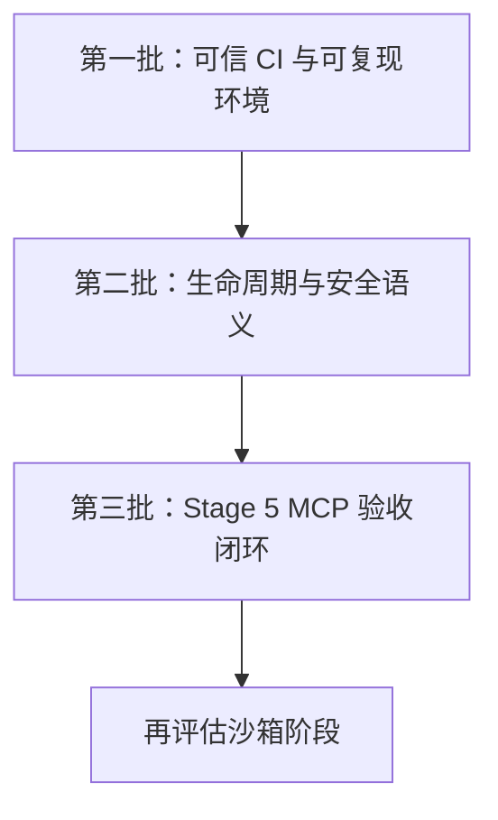
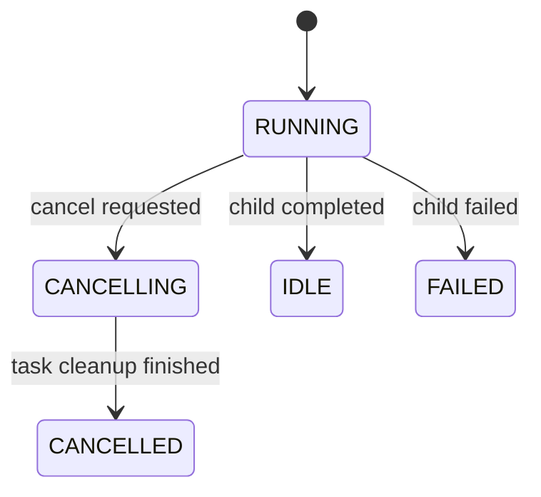

# General Agent Design：第一批、第二批、第三批问题分析与实施方案

> 编写日期：2026-07-12  
> 分析基线：`dazzlingwuming/General-Agent-Design` 当前 `main` 分支及 `doc` 历史记录  
> 使用对象：准备继续完善本项目的 Codex / 开发者  
> 本文范围：沙箱实现明确延期；本文不声称沙箱已经完成，也不在这三批中重写沙箱

## 0. 结论先行

项目现在不是“Stage 5 全部没做”，而是已经有了相当完整的骨架，但存在三类性质不同的问题：

1. **第一批：验收基础不可信。** 当前 CI、依赖解析、跨平台测试和项目说明不能稳定回答“同一提交是否通过”。在这个基础上继续加功能，会反复遇到与业务代码无关的红灯，也无法区分真实回归和环境漂移。
2. **第二批：生命周期和安全语义存在断层。** 取消、审批授权、Turn 终结、Rollout 写入失败、MCP 降级和重连的“所有权”不明确。它们平时可能正常，但在取消、崩溃、并发、配置损坏等边界下会产生错误状态。
3. **第三批：Stage 5 MCP 还缺正式验收闭环。** 现有 MCP 核心实现不应推倒重写；应补真实 404/分页测试、外部上下文注入、审批界面、二进制 Artifact、子 Agent 权限矩阵和本地 OAuth 测试。

推荐严格按顺序实施：



不能把三批压成一个大改动。第一批应先形成一个绿色、可重复的基线；第二批要用故障注入和取消测试证明状态机正确；第三批才适合补真实协议验收。

---

## 1. 分析方法与证据规则

本文把信息分成三种，避免把建议伪装成事实：

- **仓库事实**：来自当前代码、测试、Workflow 和历史记录。
- **外部依据**：来自 MCP 规范、Python 官方文档、GitHub Actions、PyPA、OWASP，以及成熟 Agent 系统的官方文档。
- **本项目设计建议**：根据前两类证据做出的适配方案。它不是协议原文，也不要求引入对应框架。

借鉴成熟系统时采用“借语义，不换框架”的原则。例如，LangGraph 的 checkpoint/interrupt 语义值得借鉴，但本项目没有必要因此改成 LangGraph；Codex App Server 的 `thread/inject_items` 与 `turn/steer` 分层值得借鉴，但本项目可以用自己的接口实现同样的所有权边界。

### 1.1 三批明确不处理的事项

- Windows Restricted Token、ACL、Job Object；
- Linux bubblewrap 的进一步隔离能力；
- WSL 沙箱的真实可用性完善；
- SSE 旧传输、Sampling、Elicitation、Tasks、Apps、Resource Subscription；
- 跨进程恢复旧 HTTP MCP Session ID；
- Context Compaction、通用 Unified Diff Parser；
- 为了“架构漂亮”而进行全项目重写。

第一批可以修正 WSL **测试的跨平台错误**，但这不等于完成 WSL 沙箱。

---

# 第一批：恢复可信 CI、可复现依赖与项目基线

## 2. 第一批的目标

第一批结束后，任意开发者或 Codex 应能回答以下问题：

1. 当前提交在受支持的 Python/OS 上是否通过？
2. 失败是代码回归、平台能力缺失，还是外部服务不可用？
3. 本地和 CI 是否安装了同一组依赖？
4. 哪些测试是默认门禁，哪些只是可选的 live smoke？
5. README 和历史记录描述的“已完成/未完成”是否与代码一致？

## 3. 问题 1：Ubuntu CI 无条件运行 Windows/WSL 路径测试

### 3.1 当前现象

`.github/workflows/agent-harness.yml` 只在 `ubuntu-latest`、Python 3.11 上运行全部测试。与此同时：

- `tests/unit/test_phase3_security.py::test_wsl_argv_keeps_posix_paths_and_linux_path` 使用 Linux 的 `tmp_path`；
- 测试随后无条件调用 `WslBubblewrapSandboxBackend._wsl_path(tmp_path)`；
- `_wsl_path()` 要求路径具有 Windows drive；Linux 临时路径没有 drive，因此抛出 `RuntimeError`。

这不是“Ubuntu 没安装 WSL”这么简单，而是**把平台相关行为放进了所有平台都会执行的单元测试**。当前 Workflow 因此不可能成为可信绿色基线。

### 3.2 根因

测试混合了两种不同责任：

1. **纯路径转换规则**：`C:\work\repo` 应转换为 `/mnt/c/work/repo`；这可以在任意系统测试。
2. **真实宿主集成能力**：`wsl.exe`、指定 distribution 和 bubblewrap 是否存在；这只能在 Windows/WSL 环境测试。

pytest 官方建议对无法在当前平台运行的测试使用条件 skip；GitHub Actions 官方 matrix 则用于覆盖多 OS/Python 组合。这里不应使用 xfail 掩盖确定性错误，因为 xfail 表示已知功能缺陷，而不是“当前 Runner 没有该平台能力”。参考 [pytest skip/xfail](https://docs.pytest.org/en/stable/how-to/skipping.html) 与 [GitHub Actions matrix](https://docs.github.com/en/actions/how-tos/write-workflows/choose-what-workflows-do/run-job-variations)。

### 3.3 落地方案

先把路径翻译改为纯函数，不依赖当前宿主的 `Path.resolve()`：

```python
def windows_path_to_wsl(path: PureWindowsPath) -> PurePosixPath:
    # 只负责语法转换，不访问文件系统，不读取 os.name
    ...
```

测试拆分：

- `test_windows_path_to_wsl_is_host_independent`：在 Linux CI 也用 `PureWindowsPath("C:/repo")` 测试；
- `test_wsl_backend_availability_on_windows`：`@pytest.mark.platform_windows`；
- `test_wsl_executes_bubblewrap`：只在显式启用的 Windows/WSL integration job 运行；
- Linux bubblewrap 测试只验证 `BubblewrapSandboxBackend`，不经 WSL adapter。

建议第一批先保留 Ubuntu 为必过门禁，再增加 Windows 的“非沙箱核心测试”。真实 WSL job 如果暂时没有合适 Runner，应标记为**未配置的 platform acceptance**，不能伪装成已通过。

### 3.4 完成标准

- Ubuntu 默认测试不调用依赖 Windows drive 的路径解析；
- 纯路径转换在 Linux 和 Windows 得到相同结果；
- 平台测试具有明确 marker 和 skip reason；
- 没有用 `try/except RuntimeError: pass` 或宽泛 xfail 掩盖问题；
- 文档明确“跨平台测试已修”不等于“沙箱已完成”。

## 4. 问题 2：测试依赖未锁定，同一提交会随时间改变结果

### 4.1 当前现象

`pyproject.toml` 中测试依赖使用开放下界，例如：

```toml
mypy>=1.10.0
pytest>=8.0.0
ruff>=0.5.0
```

Workflow 每次执行 `pip install -e ".[test]"`，因此 CI 会安装当时能解析到的最新版本。审计环境解析到较新的 mypy 后，出现以下类型问题：

- `utils/serialization.py`：无效 `type: ignore` 与 `asdict()` 参数类型；
- `mcp/config.py`：`float(Any | None)` 的两个不安全调用。

这些问题应该修，但更重要的是：**今天修完并不保证明天不会因为工具升级再次出现新结果**。

### 4.2 成熟做法

PyPA 已定义 `pylock.toml` 可复现安装规范；GitHub 的 Python Actions 指南支持根据依赖文件建立 pip cache。成熟项目通常同时保留：

- 项目声明中的兼容版本范围；
- CI/开发环境使用的已解析锁文件；
- 一个非阻塞或定时的“latest dependencies”兼容性任务，用来提前发现未来升级问题。

参考 [PyPA `pylock.toml` 规范](https://packaging.python.org/en/latest/specifications/pylock-toml/) 与 [GitHub Actions Python 构建测试指南](https://docs.github.com/en/actions/tutorials/build-and-test-code/python)。

### 4.3 落地方案

选择一种项目能够长期维护的锁定工具即可，不要同时引入多个：

- 优先：`pylock.toml` 兼容工作流；或
- 项目若已决定使用 uv，则提交 `uv.lock`；或
- 过渡方案：提交带 hash 的 constraints 文件。

推荐门禁：

```text
required CI = 从锁文件安装 + ruff + mypy + 默认 pytest
scheduled CI = 重新解析允许范围内的最新版依赖，允许先非阻塞告警
```

同时修正当前 mypy 报错，不应通过固定到恰好不报错的旧 mypy 来逃避真实类型问题。

### 4.4 完成标准

- 干净环境两次安装得到同一依赖集合；
- CI cache key 包含锁文件 hash；
- 依赖升级通过专门 PR 完成，并附质量门结果；
- `ruff`、`mypy`、`pytest` 版本可在失败日志中查询；
- 当前已知 mypy 问题以正确类型收窄解决，不新增宽泛 ignore。

## 5. 问题 3：测试层级没有隔离，默认门禁责任不清

### 5.1 当前现象

`pyproject.toml` 只声明 `live` marker，但项目实际上已经包含多类测试：

- 纯单元测试；
- 本地进程/stdio 集成；
- 本地 Streamable HTTP 集成；
- 依赖 bubblewrap/WSL 的平台测试；
- 依赖 DeepSeek 或外部 OAuth 账户的 live 测试。

如果这些类别共享一个不加区分的 `pytest -q`，任何外部条件都可能让核心门禁不稳定。

### 5.2 落地方案

定义以下 marker：

| Marker | 含义 | 默认 CI |
|---|---|---:|
| `unit` | 无网络、无子进程或使用 fake | 必过 |
| `integration_local` | 本地 stdio/ASGI/HTTP fixture | 必过 |
| `platform_linux` | 依赖 Linux/bubblewrap | Linux job 必过 |
| `platform_windows` | 依赖 Windows/WSL | 对应 job；没有 Runner 时明确未验收 |
| `live_provider` | 调用真实模型 | 非默认，手动/定时 |
| `live_oauth` | 真实外部 OAuth | 非默认，手动 |

默认 CI 不得要求 API key、浏览器登录、外部 OAuth 账户或已有 WSL distribution。真实外部联调可作为 smoke，但不能取代确定性的本地协议测试。

### 5.3 完成标准

- `pytest -m "unit or integration_local"` 在无 secret 环境稳定通过；
- 每个 skip 都说明缺少的能力；
- 必过任务不使用 `continue-on-error`；
- live 失败不会掩盖核心门禁结果，但有独立可见报告。

## 6. 问题 4：Workflow 不能人工重跑，且没有可核验的绿色记录

### 6.1 当前现象

Workflow 只有 `push` 和 `pull_request`，没有 `workflow_dispatch`。历史记录中写了“本地通过”，但仓库侧没有足够证据把 GitHub Actions 标记为已正式验收。

### 6.2 落地方案

- 加入 `workflow_dispatch`；
- 将 quality、core tests、platform tests 拆成可读 job；
- `permissions: contents: read`，不为只读 CI 提供多余 token 权限；
- 添加 concurrency，取消同一 PR 的旧运行；
- 先在分支/PR 上得到真实绿色结果，再更新阶段验收文档；
- README badge 只能在门禁真实稳定后添加。

### 6.3 完成标准

- GitHub 上存在对应 commit SHA 的绿色必过检查；
- 日志显示锁文件安装和测试分类；
- 可以手动重跑；
- 验收记录链接到具体 workflow run，而不是只写“应该通过”。

## 7. 问题 5：仓库入口与状态说明已经漂移

### 7.1 当前现象

- 根目录没有项目 README；
- 历史目录实际名称为前面带空格的 ` doc`；
- `agent-harness/README.md` 的未完成列表与当前 Stage 5 状态混杂；
- `pyproject.toml` 仍描述为 `Phase 1 single-agent harness runtime`；
- 包版本仍为 `0.1.0`，但项目已跨越多个阶段。

这不会直接制造运行时 bug，却会让 Codex 和新开发者读取错误上下文。成熟的代码 Agent 依赖仓库说明中的构建、测试和 done criteria；Codex 官方也建议用仓库级说明明确测试和完成条件，参考 [Codex AGENTS.md 指南](https://developers.openai.com/codex/guides/agents-md)。

### 7.2 落地方案

1. 将 ` doc` 重命名为 `doc`，在同一 PR 中修正所有引用；
2. 新建根 README，只写当前事实、快速开始、架构入口、测试命令和阶段状态；
3. 更新包 description；
4. 版本号是否提升由发布策略决定，但不能用版本号代替完成状态；
5. 新增 `AGENTS.md`，至少包含：工作目录、质量门、测试分类、沙箱暂缓、禁止静默扩大权限、完成定义。

### 7.3 第一批建议改动清单

- `.github/workflows/agent-harness.yml`
- `agent-harness/pyproject.toml`
- 新锁文件/constraints
- `agent-harness/src/agent_harness/sandbox/bubblewrap.py`（只提取纯路径转换）
- `agent-harness/tests/unit/test_phase3_security.py`
- marker 相关测试配置
- 根 `README.md`、`AGENTS.md`
- `agent-harness/README.md`
- ` doc/` → `doc/` 及引用

### 7.4 第一批总验收命令

```bash
python -m ruff check src tests
python -m mypy src
python -m pytest -m "unit or integration_local" -q
python -m pytest -m platform_linux -q
```

Windows/WSL 验收必须在真实对应环境单列，不应在 Linux 上模拟“已完成”。

---

# 第二批：修正生命周期、安全语义与资源所有权

## 8. 第二批的核心原则

第二批不是大型架构翻新，而是建立三个不变量：

1. **只有拥有任务的组件可以写终态。** 请求取消的调用方不能提前宣告任务已经取消。
2. **安全配置损坏必须 fail closed。** “配置不存在”与“配置存在但无效”不能产生相同行为。
3. **Thread、Turn、Item 资源必须有明确寿命。** Thread 级授权不能放在 Turn 级对象里，失败的持久化器不能被偷偷复活。

建议先明确所有权：

| 对象 | 正确作用域 | 当前主要问题 |
|---|---|---|
| MCP connections/catalog snapshot | Thread | 状态降级和重连代际不清 |
| Approval thread grants | Thread | 放在每 Turn 新建的 `ToolRuntime` 内 |
| Approval turn grants | Turn | 只有 tool name，范围过宽 |
| ToolRuntime / registry view | Turn | 可以继续每 Turn 创建 |
| Tool call / ApprovalRequest | Item | CANCEL_TURN 没有上升到 Turn 控制器 |
| RolloutRecorder | Live Thread | 写入失败非 sticky，恢复时会遗留实例 |
| ArtifactStore | Thread | 当前路径由 ToolRuntime 硬编码 |

## 9. 问题 1：子 Agent 取消过早写入 CANCELLED

### 9.1 当前现象

`runtime/subagents/scheduler.py::SubagentScheduler.cancel()` 当前流程是：

```text
状态设为 CANCELLING
task.cancel()
立即把状态设为 CANCELLED
返回
```

但 Python 的 `Task.cancel()` 只是安排在下一次事件循环机会向协程抛出 `CancelledError`，协程可能还要执行 `finally`、关闭 MCP/进程、写入 Rollout，甚至可能暂时抑制取消。Python 官方文档明确说明取消是请求，不是同步完成，参考 [asyncio Task cancellation](https://docs.python.org/3/library/asyncio-task.html)。

### 9.2 风险

- UI 显示 CANCELLED 时子任务仍在运行；
- `close(force=True)` 可能在清理完成前写 CLOSED；
- 终态被 cancel 调用方和 `_run_child` 两处竞争写入；
- MCP/文件任务可能在根 Run 已返回后继续执行。

### 9.3 落地方案



- `cancel()` 只写 `CANCELLING`、调用 `task.cancel()`、然后 `await task`；
- `CancelledError` 由 `_run_child` 的 owner/finalizer 写唯一的 `CANCELLED`；
- cancel 的调用者捕获预期的 `CancelledError`，但不吞掉其他异常；
- 加 cleanup timeout；超时状态不能伪装成 CANCELLED，应记录 `FAILED` 或专门的 cleanup failure；
- `cancel_all()` 可并发请求取消，再统一 gather，避免串行等待拖慢关闭。

### 9.4 失败测试

构造 child coroutine，在收到取消后进入一个可控 `finally`，等待 Event 才完成：

- Event 未释放时，状态必须仍是 CANCELLING；
- 释放后才变 CANCELLED；
- cleanup 只执行一次；
- sibling 不被取消；
- root close 后 `asyncio.all_tasks()` 中没有该 child owner task。

## 10. 问题 2：审批授权作用域错误，`CANCEL_TURN` 被当成普通拒绝

### 10.1 当前现象

`RunManager.run_existing()` 每个 Turn 都创建新的 `ToolRuntime`。然而：

- `_thread_grants` 保存在 `ToolRuntime` 中，所以 `ALLOW_THREAD` 到下一个 Turn 就丢失；
- grant key 只有 `(thread_id, tool_name)` 或 `(thread_id, turn_id, tool_name)`，没有参数/目标范围；
- `ALLOW_ONCE` 通过 approval id 防重复，但没有显式“只消费一个匹配调用”的 grant 模型；
- `CANCEL_TURN` 与 `DENY_ONCE` 走同一 `ToolAuthorizationError`，因此不会真正取消 Turn。

成熟 Agent SDK 将审批表示为 run interruption，并可序列化、恢复后应用 allow/reject 决定；这说明审批首先是控制流状态，而不只是工具抛错。参考 [OpenAI Agents SDK Human-in-the-loop](https://openai.github.io/openai-agents-python/human_in_the_loop/) 和 [LangGraph interrupts](https://docs.langchain.com/oss/python/langgraph/interrupts)。

### 10.2 落地方案

新增 Thread 级 `ApprovalGrantStore`，由 `ThreadRuntime` 持有并注入每个 `ToolRuntime`：

```python
@dataclass(frozen=True)
class GrantKey:
    thread_id: str
    turn_id: str | None
    principal_id: str
    tool_name: str
    argument_fingerprint: str | None
    target_scope: tuple[str, ...]

class ApprovalGrantStore:
    def consume_once(...): ...
    def allows_turn(...): ...
    def allows_thread(...): ...
    def clear_turn(turn_id: str): ...
```

设计约束：

- `ALLOW_ONCE`：只对当前 `tool_call_id + argument fingerprint` 生效，消费后删除；
- `ALLOW_TURN`：默认也应限制到工具和安全目标，例如允许读某路径，不能自动允许同名工具删除另一目录；
- `ALLOW_THREAD`：跨 Turn 保留，但仍受 principal 的 capability ceiling 和 sandbox policy 约束；
- 子 Agent 不自动继承 Root 的历史 grant；若产品确实要继承，必须显式定义且不能超过 parent ceiling；
- 参数预览先做 secret redaction，不能把 bearer token、password、Authorization 等写进 Rollout；
- 定义独立 `TurnCancellationRequested` 控制信号，`TurnController` 捕获后走取消终结，而不是生成普通 tool error。

### 10.3 完成标准

- `ALLOW_THREAD` 在同一 Thread 的下一个 Turn 生效；
- 新 Thread 不继承；
- 不同参数/路径不能被过宽 grant 意外放行；
- `ALLOW_ONCE` 恰好消费一次；
- `CANCEL_TURN` 产生 `turn.cancelled`，不继续模型循环；
- 审批记录不包含 secret 明文。

## 11. 问题 3：Admin MCP 配置解析失败时 fail open

### 11.1 当前现象

`mcp/config.py::_read_admin_config()` 在文件不存在时返回空策略；但在文件存在且 JSON 损坏、类型错误或读取失败时，也只追加 diagnostic，然后返回空策略和空 server map。

这会把“管理员没有配置”与“管理员试图限制，但配置损坏”合并为同一个结果。随后 User/Project/Local scope 可能正常启用 server，形成 fail-open。

### 11.2 成熟做法

OWASP 的 fail-safe defaults 强调默认拒绝；Codex 的 managed configuration 对 MCP allowlist 也要求 name 与 server identity 同时匹配，否则禁用。参考 [OWASP Secure Code Review—fail-safe defaults](https://cheatsheetseries.owasp.org/cheatsheets/Secure_Code_Review_Cheat_Sheet.html) 和 [Codex managed configuration](https://developers.openai.com/codex/enterprise/managed-configuration)。

### 11.3 落地方案

把读取结果建模为：

```text
ABSENT  -> 没有管理员策略，继续合并其他 scope
VALID   -> 严格执行管理员策略
INVALID -> 禁用受管理 MCP 子系统或启动失败；绝不退化成空策略
```

建议默认只阻止 MCP 子系统，不必让完全不使用 MCP 的本地功能全部不可用；但如果 admin 文件还管理其他安全子系统，应在更高层统一决定启动失败范围。

另外，Admin server identity 不应只按显示名称匹配。对 HTTP 至少绑定 canonical URL/origin，对 stdio 绑定规范化 command/args identity，防止低 scope 用同名不同端点冒充。

### 11.4 失败测试

- admin 文件不存在：User server 可按正常规则加载；
- admin 文件存在但 JSON 截断：User/Project MCP 全部不启用；
- admin policy 类型错误：同上；
- 同名但 URL/command identity 不匹配：禁用并产生 sanitized diagnostic；
- diagnostic 不泄露 header/token。

## 12. 问题 4：RolloutRecorder 写入失败不是 sticky failure

### 12.1 当前现象

`threads/recorder.py` 的 writer task 如果 `_append_items()` 抛错会结束；但 `start()` 发现 task done 后会创建一个新 writer。原始异常没有保存在 recorder 状态中，队列里的 flush/shutdown ack 也可能无人完成。

### 12.2 风险

- Rollout 已丢失，但后续调用看起来恢复正常；
- `flush()` 或 `shutdown()` 永久等待；
- 同一 Thread 的持久化历史出现不可解释的缺口；
- 上层仍返回成功，破坏审计可信度。

### 12.3 落地方案

显式状态机：

```text
OPEN -> FAILED
OPEN -> CLOSING -> CLOSED
FAILED 为 sticky；不得自动回到 OPEN
```

具体要求：

- writer 捕获首个异常并写入 `_failure`；
- `record`、`record_nowait`、`flush`、`shutdown` 首先调用 `_raise_if_failed()`；
- 失败时遍历队列，为所有 `_FlushCommand` / `_ShutdownCommand` ack 设置同一异常；
- writer 失败后 `start()` 不得重建；
- shutdown 使用有界 timeout，并在取消场景用 `asyncio.shield` 保护必要的终态写入，但 shield 也必须有超时；
- `record_nowait` 无法同步抛给异步调用者时，应触发 thread/runtime failure callback，不能静默记录日志后继续。

### 12.4 失败测试

用可注入 writer 第 N 次写入抛 `OSError`：

- 第一个 flush 收到原始异常；
- 后续 record/flush 立即收到同一异常；
- writer 不重启；
- shutdown 在限定时间内返回异常，不挂死；
- Turn 不得被标记 completed。

## 13. 问题 5：恢复 incomplete Turn 时创建两个 LiveThread/Recorder

### 13.1 当前现象

`LocalThreadStore.resume_thread()` 发现 incomplete Turn 后：

1. 创建一个 `LiveThread`；
2. 追加 `turn.interrupted` 并 flush；
3. 不 shutdown 这个实例；
4. 再创建第二个 `LiveThread` 返回。

第一个 recorder writer 因此成为无所有者任务。

### 13.2 落地方案

只创建一次 `live`：读取 metadata/history 后创建，必要时追加 interrupted item，再更新 metadata，最后返回同一实例。恢复过程必须满足：

- 对每个 incomplete turn 只追加一次 `turn.interrupted`；
- 多次 resume 幂等；
- 返回对象拥有唯一 recorder；
- 任意中途异常都会 shutdown 已创建 recorder。

LangGraph 的成熟语义是中断前保存状态、恢复时从持久化检查点继续；本项目不需要复制其图执行器，但应借鉴“持久化边界先于可恢复状态”的原则，参考 [LangGraph persistence](https://docs.langchain.com/oss/python/langgraph/persistence) 与 [checkpointers](https://docs.langchain.com/oss/python/langgraph/checkpointers)。

## 14. 问题 6：Turn 取消时没有一致的终态和 metadata 回收

### 14.1 当前现象

`ConversationSession.run_turn()` 在 `try/finally` 中只确保清除 `manager.rollout_audit`。如果 `run_existing()` 被取消，后面的 `turn.completed/turn.failed`、Thread IDLE metadata、flush 和 summary 都不会执行。

进程下次 resume 虽可补 `turn.interrupted`，但在同一进程内 Thread 可能长期保持 ACTIVE。

### 14.2 落地方案：最小 TurnController

不要立即重写整个 RunManager。先抽出一个只负责终结的 `TurnController`：

```python
class TurnController:
    async def start(...): ...
    async def complete(state): ...
    async def fail(error): ...
    async def cancel(reason): ...
    async def interrupt(reason): ...
```

不变量：

- 一个 Turn 恰好一个 terminal item；
- terminal 类型只能是 completed / failed / cancelled / interrupted；
- terminal item、Thread metadata 和 summary 使用同一个 finalization path；
- finalization 有幂等 guard；
- 持久化失败高于“业务执行成功”，即不能返回 completed；
- 取消期间必要 cleanup 被保护但有 timeout；
- audit sink 总能解绑。

### 14.3 完成标准

- 在模型调用、工具调用、审批等待、子 Agent 等不同边界取消，均得到一致 `turn.cancelled`；
- Thread 回到 IDLE，active_turn_id 清空；
- 进程崩溃恢复才使用 `turn.interrupted`，用户主动取消不混为 interrupted；
- 重复 finalize 不产生第二个 terminal item。

## 15. 问题 7：MCP `DEGRADED` 状态既会被覆盖，也会被排除出可用集合

### 15.1 当前现象

- `refresh_catalogs()` 在分页被截断时将 status 设为 `DEGRADED`；
- `connect()` 返回后又无条件设为 `READY`，覆盖降级；
- `MCPServerManager.active_servers` 只包含 `READY`；如果后续刷新真的变为 `DEGRADED`，runtime adapter 又找不到它；
- refresh 中途失败时，当前代码没有完整的 last-good atomic snapshot 语义。

这说明 status 同时承担“连接能否使用”和“目录是否健康”两个维度，导致互相冲突。

### 15.2 落地方案

可以选择两种实现，推荐第二种更清晰：

1. 最小修复：`is_usable = status in {READY, DEGRADED}`，且 connect 不覆盖 refresh 结果；
2. 推荐：拆分 `availability` 与 `health`。

```text
availability: NOT_CONNECTED / CONNECTING / USABLE / STOPPING / STOPPED / FAILED
health: HEALTHY / DEGRADED
```

Catalog 更新采用 copy-on-write：

1. 在局部变量构建 candidate tools/resources/prompts/templates；
2. 全部验证、去重和分页完成后，一次性替换 immutable snapshot；
3. 刷新失败保留 last-good snapshot，标记 stale + degraded；
4. 首次连接且没有任何 usable snapshot 时才是 FAILED；
5. 截断 snapshot 可以使用，但 UI/trace 必须显示 partial。

### 15.3 完成标准

- truncated server 仍可调用已发现工具；
- refresh 失败不清空 last-good catalog；
- 第一次初始化失败不会伪装成 degraded usable；
- runtime 的所有入口统一调用 `is_usable`，不各自判断 enum。

## 16. 问题 8：HTTP 404 重连有锁，但没有 single-flight 去重

### 16.1 当前现象

`_reconnect_lock` 只保证同一时刻一个重连。两个并发读操作都在旧 session 收到 404 时：

- 第一个获得锁并建立新 session；
- 第二个随后获得锁，但不知道第一个已更新代际；
- 第二个可能关闭刚建立的新 session，再重连一次。

### 16.2 落地方案

为 connection 增加单调递增 `generation`：

```python
observed = connection.generation
try:
    return await operation(session)
except SessionNotFound:
    await connection.reinitialize_if_generation(observed)
    return await operation(connection.current_session)
```

在锁内重新检查：若 generation 已变化，直接复用新 session；否则由当前调用执行重建并加一。对于 `tools/call`：

- 可以重建 connection 供后续调用使用；
- **不得自动重放原 Tool call**，因为旧调用可能已产生副作用；
- 返回 outcome unknown。

MCP 规范明确要求带旧 `MCP-Session-Id` 的请求收到 HTTP 404 后发起无 session id 的新 Initialize；官方 Python SDK 也曾有未自动执行该行为的问题报告。参考 [MCP Streamable HTTP Session Management](https://modelcontextprotocol.io/specification/2025-11-25/basic/transports) 与 [python-sdk issue #1676](https://github.com/modelcontextprotocol/python-sdk/issues/1676)。

## 17. 问题 9：Artifact 路径绕过配置，资源所有权不统一

`ToolRuntime._write_mcp_artifact()` 当前硬编码：

```text
workspace_root/.harness/threads/<thread_id>/artifacts/mcp
```

但项目已经允许 `config.trace.thread_directory` 指向其他位置。结果是 Rollout 在配置目录，Artifact 却写到 workspace 默认目录。

第二批只做所有权修正：引入 Thread 级 `ArtifactStore` 接口，并由 session/runtime 根据 `trace.thread_directory / thread_id` 创建后注入 ToolRuntime。第三批再补二进制、quota 和 retention。

## 18. 第二批建议改动顺序

不要按文件横向大改，按风险纵向拆 PR：

1. **PR 2.1**：Subagent cancellation owner + 测试；
2. **PR 2.2**：RolloutRecorder sticky failure + resume 单实例；
3. **PR 2.3**：TurnController terminalization；
4. **PR 2.4**：ApprovalGrantStore + CANCEL_TURN；
5. **PR 2.5**：Admin config tri-state fail-closed；
6. **PR 2.6**：MCP usability/last-good snapshot + generation single-flight；
7. **PR 2.7**：ArtifactStore 路径注入。

每个 PR 应先加入会失败的测试，再改实现。第二批完成前不能仅凭 happy-path 测试宣称生命周期正确。

---

# 第三批：完成 Stage 5 MCP 的正式验收闭环

## 19. 第三批的定位

当前 MCP 已有官方 SDK stdio/Streamable HTTP、Catalog、工具调用、资源/Prompt 读取、基础 OAuth、审批策略和子 Agent 显式子集等骨架。第三批的目标不是增加所有新协议能力，而是把历史记录中明确未完成的项目变成可重复验收。

## 20. 问题 1：真实 HTTP Session 404 端到端测试缺失

### 20.1 为什么单元测试不够

当前 typed httpx 404 单元测试能证明异常分类，但不能证明以下完整链路：

- 旧请求真的带 `MCP-Session-Id`；
- server/proxy 返回 HTTP 404；
- 旧 transport/session 被关闭；
- 新 Initialize 不带旧 session id；
- Catalog 被刷新；
- 只读调用只重试一次；
- 并发 404 只发生一次新初始化。

### 20.2 成熟测试方法

不要等待 FastMCP fixture 提供“删除 session”的内部接口。使用一个**故障注入 ASGI middleware/proxy**：

1. 正常代理 Initialize 并记录 session id；
2. 对第一条带该 id 的指定读请求返回 404；
3. 观察客户端重新 Initialize；
4. 后续流量正常转发。

这仍是通过真实 HTTP transport 和官方 SDK 的 integration test，不是 mock 掉 connection 方法。

### 20.3 必测矩阵

| 场景 | 预期 |
|---|---|
| `resources/read` 首次 404 | 重建一次，读操作成功 |
| `prompts/get` 首次 404 | 重建一次，读操作成功 |
| `tools/call` 404 | 重建连接，但不重放；返回 outcome unknown |
| 两个并发读均观察旧 generation | 只 Initialize 一次，两者使用新 generation |
| 新 Initialize 也失败 | 返回稳定 connection error，无无限循环 |

## 21. 问题 2：真实多页 MCP Server Integration Test 缺失

### 21.1 当前缺口

分页 helper 已有 mock 覆盖，但尚未证明官方 SDK 经过真实 stdio/HTTP 序列化后，Tools、Resources、Resource Templates、Prompts 都能完整翻页。

MCP 规范要求 cursor 是 opaque token，客户端不能解析、修改或跨 session 持久化；四个 list 操作都支持分页。参考 [MCP Pagination](https://modelcontextprotocol.io/specification/2025-11-25/server/utilities/pagination)。

### 21.2 落地方案

用官方 MCP Python SDK 的 low-level server handler 构建 deterministic fixture：

- 每类目录 5 个项目，每页 2 个；
- cursor 使用不含页码语义的随机映射，例如 `opaque-A` → internal offset；
- 同一 fixture 同时提供 stdio 与 ASGI HTTP 启动方式；
- 不让客户端知道 page size 或 cursor 格式。

必测：完整收集、稳定顺序、重复 cursor、无效 cursor、max pages、max items、取消刷新、刷新中途失败保留 last-good。

被 limits 截断时应是 partial/degraded 但 usable，而不是 READY full，也不是完全 FAILED。

## 22. 问题 3：Resource/Prompt 只能打印，不能进入当前或下一 Turn

### 22.1 正确控制权

MCP 规范将 Resources 定义为 application-driven，由 host 决定如何选择并纳入上下文；Prompts 则是 user-controlled。参考 [MCP Resources](https://modelcontextprotocol.io/specification/2025-11-25/server/resources) 与 [MCP Prompts](https://modelcontextprotocol.io/specification/2025-11-25/server/prompts)。

因此：

- 用户执行 `/mcp resource ...` 可以产生“用户选择的外部上下文”；
- `/mcp prompt ...` 可以产生用户显式选择的 Prompt 内容；
- 它们不能拼进 system prompt；
- server 返回的文本始终是不可信外部内容，不能覆盖系统/权限规则。

### 22.2 建议数据模型

```python
@dataclass(frozen=True)
class ExternalContextItem:
    source_kind: Literal["mcp_resource", "mcp_prompt"]
    server_name: str
    resource_uri_or_prompt_name: str
    mime_type: str | None
    content_hash: str
    trust_label: str
    size_bytes: int
    content: str | ArtifactRef
    selected_by: str  # user
```

处理规则：

- Thread 空闲：加入 `PendingExternalContext`，下一个 Turn 在 user message 之后注入；
- Turn 活动：放入 `TurnSteerMailbox`，只在模型调用之间的安全边界合并；
- 已经发出的模型请求不做中途 mutation；
- 按 hash 去重；
- 应用单项和 Turn 总大小限制；
- Rollout 记录来源、hash、MIME、大小和是否 artifact-backed。

Codex App Server 把持久化的 `thread/inject_items` 与活动 Turn 的 `turn/steer` 分开，这正好说明“线程历史注入”和“运行中转向”不是同一生命周期操作。可借鉴其语义，参考 [Codex App Server](https://developers.openai.com/codex/app-server)。

### 22.3 验收

- idle 选择资源后，下一个模型输入可见且 Rollout 可追溯；
- active turn 注入只在安全边界生效；
- 资源内容明确标记为 external/untrusted；
- 不进入 system role；
- 超限内容存 Artifact 并只注入受控摘要/引用；
- 相同内容不会重复消耗上下文。

## 23. 问题 4：Approval UI 未显示足够的决策信息

### 23.1 当前缺口

底层 metadata 已包含部分 server、mode、annotations 和 trust，但终端用户尚不能完整判断“这次调用到底是谁、要做什么、为什么要问”。

### 23.2 应显示字段

- 配置 scope：Admin/User/Project/Local；
- server 显示名与经过校验的 endpoint/command identity 摘要；
- remote tool name 和 canonical tool name；
- effective approval mode，以及它来自哪一层 override；
- side-effect/risk 分类；
- server annotations；
- annotation 是否来自 trusted server；
- 参数预览，secret redacted；
- 当前 principal：root 还是 child agent；
- 可选决定：allow once / allow turn / allow thread / deny once / cancel turn。

Server annotation 只能辅助展示，不能让不可信 server 自称 read-only 后绕过权限。OpenAI Agents SDK 的 MCP 支持按 server/tool 设置 approval policy，也把 HITL 做成可暂停恢复的 flow，可作为产品行为参考：[Agents SDK MCP](https://openai.github.io/openai-agents-python/mcp/) 与 [Human-in-the-loop](https://openai.github.io/openai-agents-python/human_in_the_loop/)。

### 23.3 验收

- untrusted `readOnlyHint=true` 仍按 host policy ASK；
- child principal 清晰显示；
- secret 不出现在屏幕、trace、rollout；
- `cancel turn` 真正触发第二批定义的 Turn cancellation。

## 24. 问题 5：二进制 Artifact、配额和清理策略未完成

### 24.1 当前现象

大文本/JSON 可以写文件，但 Image/Audio 仍主要保留 base64/协议引用；没有统一 encoded/decoded size limit、Thread 总量 quota 和 retention。

### 24.2 落地方案

扩展第二批的 `ArtifactStore`：

```python
class ArtifactStore:
    async def put_bytes(
        self,
        data: bytes,
        declared_mime: str | None,
        source: ArtifactSource,
    ) -> ArtifactRef: ...
```

安全要求：

- 文件名和 artifact id 由 host 生成，不使用 server 提供的 path/name；
- 计算完整 SHA-256，支持内容去重；
- 验证 base64 解码失败、encoded size、decoded size；
- MIME allowlist + 内容 sniffing；不只信 Content-Type；
- 原子写入临时文件后 rename；
- 单 item、单 Turn、单 Thread 三层 quota；
- quota 超限返回稳定 error，不能只截断后假装成功；
- metadata 记录 server/tool/call id/hash/size/MIME/created_at；
- retention 默认为随 Thread，提供显式 cleanup；
- Artifact 目录不可被普通项目写工具绕过。

OWASP 对上传内容建议使用 allowlist、不要信任客户端文件名和 Content-Type、限制大小、由应用生成文件名并隔离存储。这些原则同样适用于不可信 MCP Server 送来的二进制内容。参考 [OWASP File Upload Cheat Sheet](https://cheatsheetseries.owasp.org/cheatsheets/File_Upload_Cheat_Sheet.html)。

## 25. 问题 6：Subagent MCP 只有结构性覆盖，缺权限端到端矩阵

### 25.1 为什么不应首先用真实模型验正确性

真实模型可能不稳定地选择是否调用工具，失败时无法区分模型行为与 runtime bug。核心验收应使用 scripted fake provider：它固定发出一个 MCP tool call，再提交固定结果。

### 25.2 必测不变量

- child 只注册 `DelegationRequest.allowed_mcp_tools` 的显式子集；
- 不存在于 catalog 的工具不能凭名称注入；
- child capability/permission 不超过 parent ceiling；
- child principal 的 agent/thread/turn attribution 出现在 approval 和 trace；
- root 的 ALLOW_ONCE/ALLOW_TURN 不自动泄露给 child；
- child 复用 root Thread 的 MCP connection，不为每个 child 启动一套 server；
- root close 前先取消/等待 child，随后 connection 只关闭一次；
- 一个 child 取消不影响 sibling。

成熟 Agent 系统也倾向给子 Agent 独立上下文、专用 prompt 和特定工具权限。参考 [Claude Code subagents](https://docs.anthropic.com/en/docs/claude-code/sub-agents) 和 [Codex subagents](https://developers.openai.com/codex/subagents)。这里只借鉴权限收窄与结果回收，不照搬产品实现。

真实 DeepSeek 模型测试可以保留为可选 smoke，不能作为确定性 acceptance gate。

## 26. 问题 7：OAuth 验收不应被真实外部账号阻塞

### 26.1 当前状态

Identity、Keyring 隔离、login/logout 路径已有实现，但真实浏览器授权、refresh 和 logout 尚未完整外部联调。

### 26.2 落地方案

先建立本地标准化 OAuth fixture：

- protected resource metadata / authorization server discovery；
- authorization code + PKCE；
- localhost callback；
- access token 过期与 refresh；
- invalid_grant；
- logout/credential deletion；
- 同名 server 不同 canonical resource URI 的 identity 隔离；
- scope 改变后不错误复用旧 token。

外部账户只做手动 smoke，并记录 provider、日期和结果。官方 MCP Python SDK 仍可能出现 OAuth 边缘兼容问题，例如成功 token exchange 后未重试认证请求的报告，因此更需要把 host 自己的确定性验收与外部兼容性分开。参考 [python-sdk issue #2577](https://github.com/modelcontextprotocol/python-sdk/issues/2577)。

## 27. BM25 Tool Search：不是 Stage 5 完成阻塞项

当前稳定的 name/description substring search 虽不高级，但只要规模小、排序稳定、没有错误披露，就不应为了“看起来成熟”立即引入搜索基础设施。

先记录：catalog 大小、search query、零结果率、用户/模型选错率、披露 token。只有指标证明 substring 不够，再考虑 SQLite FTS5 的内置 `bm25()`。参考 [SQLite FTS5](https://www.sqlite.org/fts5.html)。

因此第三批对 BM25 的完成定义是：**明确延期并建立触发条件**，不是强行实现。

## 28. 第三批明确延期能力

以下项目不应阻塞 Stage 5 核心正式验收：

- 旧 SSE transport；
- Sampling、Elicitation、Tasks、Apps；
- Resource Subscription；
- 跨进程恢复 HTTP session id；
- 每个外部 OAuth provider 的 live 兼容；
- BM25；
- 沙箱完善。

延期项必须进入公开 checklist，而不是从文档中消失。

---

# 29. 三批整体实施路线

## 29.1 推荐 PR 序列

| 序号 | 内容 | 前置 | 可独立回滚 |
|---:|---|---|---:|
| 1 | WSL 测试拆分、marker、CI 触发 | 无 | 是 |
| 2 | 锁文件、修 mypy、CI cache | 1 | 是 |
| 3 | README/AGENTS/doc 目录清理 | 1 | 是 |
| 4 | Subagent cancel owner | 第一批绿色 | 是 |
| 5 | Recorder sticky failure + resume 单实例 | 4 | 是 |
| 6 | TurnController terminalization | 5 | 是 |
| 7 | ApprovalGrantStore + CANCEL_TURN | 6 | 是 |
| 8 | Admin fail-closed | 7 | 是 |
| 9 | MCP health/snapshot/generation | 5 | 是 |
| 10 | ArtifactStore 注入 | 5 | 是 |
| 11 | 真实 404 + 真实分页 fixture | 9 | 是 |
| 12 | Resource/Prompt external context | 6, 10 | 是 |
| 13 | Approval UI | 7 | 是 |
| 14 | Binary Artifact/quota | 10 | 是 |
| 15 | Subagent MCP deterministic E2E | 4, 7, 9 | 是 |
| 16 | Local OAuth fixture | 9 | 是 |

## 29.2 每个 PR 的强制交付物

- 一条清楚的失败复现；
- 先失败、后通过的针对性测试；
- 修改后的不变量；
- 是否影响持久化格式/兼容性；
- 最小相关测试 + 全量默认门禁；
- 更新对应历史记录中的“完成/延期”状态；
- 不顺手修改沙箱范围外的设计。

# 30. 最终验收矩阵

| 领域 | 必须证明 | 禁止用来代替的证据 |
|---|---|---|
| CI | 对应 SHA 的 GitHub required checks 绿色 | “本地应该能过” |
| 依赖 | 锁文件干净安装可重复 | 某台机器的现有 venv |
| 取消 | cleanup 完成后才写终态 | 只检查 `task.cancelled()` |
| Turn | 每 Turn 恰好一个 terminal item | 进程重启后才补 interrupted |
| Rollout | 写失败 sticky 且不挂 shutdown | 打日志后继续 |
| Admin | invalid config 禁用受管 MCP | diagnostic + 空策略 |
| MCP 降级 | last-good 可用且明确 partial | 把 DEGRADED 改回 READY |
| 404 | 真实 HTTP header/session 流程 | 只 mock `_is_session_not_found` |
| 分页 | 真实 stdio/HTTP 多页 | 只测 helper |
| Tool call 404 | outcome unknown，不重放 | 自动 retry 副作用调用 |
| External context | user-selected、可追溯、非 system | CLI 只打印 |
| Approval | scope/identity/风险/参数可见且脱敏 | 只显示工具名 |
| Artifact | hash/MIME/quota/原子写/清理 | 单纯保存 base64 文本 |
| Subagent MCP | 工具子集、权限 ceiling、attribution | 真实模型偶然调用成功 |
| OAuth | 本地 PKCE/refresh/identity 确定性测试 | 只登录一个外部账号 |

# 31. 建议 Codex 开工前先回答的检查清单

把本文交给 Codex 后，不应直接让它“一次全部改完”。要求它在每个批次开工前先输出：

1. 将要修改的准确文件和类；
2. 当前问题的最小复现；
3. 新增失败测试名称；
4. 状态/所有权不变量；
5. 是否改变持久化格式；
6. 兼容/迁移方案；
7. 不在本 PR 处理的事项；
8. 验收命令；
9. 与本文建议不同之处及外部依据。

建议给 Codex 的执行提示：

```text
请按本文 PR 序列逐个实施，不要合并三批。
每项先写能稳定失败的测试，再做最小实现。
不要重写 MCP JSON-RPC，继续使用官方 SDK。
不要自动重试结果未知的 tools/call。
不要吞 CancelledError。
不要让无效 Admin 安全配置退化为空策略。
不要用真实模型或真实 OAuth 账号替代确定性测试。
不要修改或宣称完成沙箱。
每个 PR 完成后运行锁定环境中的 ruff、mypy、默认 pytest，
并更新对应验收记录；没有 GitHub 对应 SHA 的绿色检查，不得写“CI 已完成”。
```

# 32. 最终完成定义

三批完成后，项目才可以准确描述为：

> Agent Harness 已建立可复现、可核验的核心质量门；Thread/Turn/Subagent/Approval/Rollout/MCP 的取消、失败、恢复和降级语义具有明确所有权；Stage 5 MCP 核心能力已通过真实本地协议、故障注入和权限矩阵验收。沙箱及明确延期的 MCP 扩展能力仍未完成。

不能描述为：

> 整个 General Agent 已完成，或沙箱已经安全可用于不可信代码。

---

# 参考资料

## 协议与 Agent 系统

- [MCP 2025-11-25：Transports / Session Management](https://modelcontextprotocol.io/specification/2025-11-25/basic/transports)
- [MCP 2025-11-25：Pagination](https://modelcontextprotocol.io/specification/2025-11-25/server/utilities/pagination)
- [MCP 2025-11-25：Resources](https://modelcontextprotocol.io/specification/2025-11-25/server/resources)
- [MCP 2025-11-25：Prompts](https://modelcontextprotocol.io/specification/2025-11-25/server/prompts)
- [MCP Python SDK issue #1676：404 后未新建 session](https://github.com/modelcontextprotocol/python-sdk/issues/1676)
- [MCP Python SDK issue #2577：OAuth token exchange 后请求重试问题](https://github.com/modelcontextprotocol/python-sdk/issues/2577)
- [OpenAI Agents SDK：Human-in-the-loop](https://openai.github.io/openai-agents-python/human_in_the_loop/)
- [OpenAI Agents SDK：MCP](https://openai.github.io/openai-agents-python/mcp/)
- [Codex App Server](https://developers.openai.com/codex/app-server)
- [Codex managed configuration](https://developers.openai.com/codex/enterprise/managed-configuration)
- [Codex subagents](https://developers.openai.com/codex/subagents)
- [LangGraph interrupts](https://docs.langchain.com/oss/python/langgraph/interrupts)
- [LangGraph persistence](https://docs.langchain.com/oss/python/langgraph/persistence)
- [LangGraph checkpointers](https://docs.langchain.com/oss/python/langgraph/checkpointers)
- [Claude Code subagents](https://docs.anthropic.com/en/docs/claude-code/sub-agents)

## Python、CI、打包与安全

- [Python asyncio tasks and cancellation](https://docs.python.org/3/library/asyncio-task.html)
- [GitHub Actions：matrix job variations](https://docs.github.com/en/actions/how-tos/write-workflows/choose-what-workflows-do/run-job-variations)
- [GitHub Actions：Building and testing Python](https://docs.github.com/en/actions/tutorials/build-and-test-code/python)
- [pytest：skip and xfail](https://docs.pytest.org/en/stable/how-to/skipping.html)
- [PyPA：`pylock.toml` Specification](https://packaging.python.org/en/latest/specifications/pylock-toml/)
- [OWASP Secure Code Review Cheat Sheet](https://cheatsheetseries.owasp.org/cheatsheets/Secure_Code_Review_Cheat_Sheet.html)
- [OWASP File Upload Cheat Sheet](https://cheatsheetseries.owasp.org/cheatsheets/File_Upload_Cheat_Sheet.html)
- [SQLite FTS5 / bm25](https://www.sqlite.org/fts5.html)

